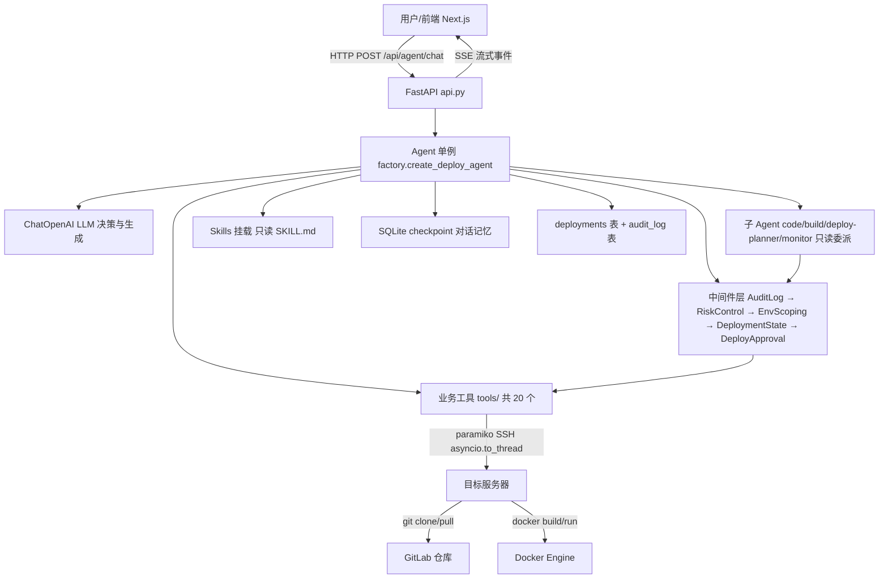

# AI DevOps — Agent 驱动的软件自动交付部署系统

基于 **DeepAgents** 框架的部署 Agent Demo：从用户提出部署需求，到自动完成「代码拉取 → 镜像构建 → 人工审批 → 停旧容器 → 起新容器 → 健康检查」的全流程自动化交付。

## 目录

- [功能特性](#功能特性)
- [技术栈](#技术栈)
- [整体架构](#整体架构)
- [目录结构](#目录结构)
- [快速开始](#快速开始)
- [配置说明](#配置说明)
- [API 概览](#api-概览)
- [测试](#测试)
- [常见问题](#常见问题)
- [相关文档](#相关文档)

## 功能特性

- **工具调用**：20 个受控工具（git 拉取、docker 构建/启停/巡检、工作区文件读写、白名单管理、部署状态查询/回滚），Agent 只负责编排，实际命令经 SSH 在目标服务器执行
- **任务编排**：按标准部署 SOP 顺序自动执行；4 个只读子 Agent（code / build / deploy-planner / monitor）分担拉码、构建、规划、巡检，高风险写操作只收口主 Agent
- **人工审批（Human-in-the-loop）**：高风险操作（默认停/起容器、回滚，可配 `APPROVAL_REQUIRED_TOOLS`）需用户批准后才执行
- **实时交互**：SSE 流式输出 Agent 进度、工具调用卡片、实时构建日志（`build_log`）与任务状态
- **对话记忆**：会话落盘 SQLite checkpoint（`backend/checkpoints/checkpoints.db`），后端重启后仍可续聊，支持多会话历史恢复与跨端同步
- **部署状态与审计**：工具成功后自动更新部署状态（`deployments` 表），全链路操作审计落库（`audit_log` 表），可查历史与回滚
- **错误处理**：命令失败重试一次，仍失败如实上报并打码敏感信息
- **安全设计**：容器名/镜像前缀/工作区三重白名单校验；密码/Token 不进 system prompt；日志打码

## 技术栈

| 类别 | 选型 | 用途 |
|------|------|------|
| Agent 框架 | DeepAgents 0.4.12 | Agent 核心 + 中间件 + Skills 挂载 + 子 Agent |
| 工作流引擎 | LangGraph（DeepAgents 内置） | 状态机、checkpoint、interrupt/resume |
| 检查点存储 | langgraph-checkpoint-sqlite | 对话记忆 SQLite 持久化 |
| LLM 接入 | langchain-openai 1.2.1 | 兼容 OpenAI 协议的模型 |
| Web 框架 | FastAPI ≥0.135.2 | HTTP 接口 + SSE 流式响应 |
| SSH 客户端 | paramiko ≥3.5.0 | 远程执行 git/docker 命令 |
| 配置管理 | pydantic-settings ≥2.13.1 | 从 `.env` 加载配置 |
| 日志 | loguru ≥0.7.3 | 控制台 + 文件双输出 |
| Web 服务器 | uvicorn ≥0.42.0 | ASGI 服务器 |
| 前端 | Next.js 16 + React 19 | BFF 代理 + 对话工作台 UI |
| 测试 | pytest + pytest-asyncio / vitest | 后端 / 前端测试 |

## 整体架构



**关键设计**：Agent 所在机器只负责编排，git/docker 等操作通过 SSH 到目标服务器执行，避免本机环境污染。

## 目录结构

```
ai_devops/
├── backend/                  # Python 后端（uv 管理）
│   ├── src/deploy_agent/     # 主包
│   │   ├── api.py            # FastAPI 路由 + SSE 事件流
│   │   ├── factory.py        # Agent 装配（LLM/Skills/中间件/子 Agent/后端）
│   │   ├── runtime.py        # RuntimeContext
│   │   ├── middleware.py     # AuditLog + RiskControl + EnvScoping + DeploymentState + 审批中间件
│   │   ├── state.py          # 部署状态存储（deployments 表）
│   │   ├── audit.py          # 操作审计存储（audit_log 表）
│   │   ├── prompts.py        # 系统提示词
│   │   ├── settings.py       # pydantic-settings 配置加载
│   │   ├── logging.py        # loguru 日志配置
│   │   └── tools/            # git/docker/文件/白名单/状态/回滚 20 个工具
│   ├── skills/deployment/SKILL.md   # 部署 SOP 技能文档（只读）
│   ├── tests/                # pytest 测试（含 evals 门禁，见「测试」）
│   ├── checkpoints/          # 对话记忆/部署状态/审计 SQLite 落盘（gitignore）
│   ├── logs/                 # 运行日志（gitignore）
│   ├── whitelist.json        # 容器/镜像白名单运行时持久化（对话中增删后生成）
│   ├── .env                  # 后端配置（勿提交）
│   ├── pyproject.toml        # 依赖 + uv 配置
│   └── uv.lock
├── frontend/                 # Next.js 前端（BFF 代理 + 对话工作台）
│   ├── app/                  # App Router 页面
│   ├── components/           # 侧边栏/任务状态条/消息流/Composer 等
│   ├── lib/                  # SSE 解析、日志、后端请求封装
│   ├── __tests__/            # vitest 测试
│   └── .env.development      # 前端环境变量
├── docs/                     # ADR 决策、词汇表、路线图、agent 协作规范
│   ├── adr/                  # 架构决策记录（ADR-0001 ~ ADR-0005）
│   ├── 词汇表.md
│   └── 路线图.md
├── 架构分析文档.md            # 架构设计分析
├── 项目运转流程.md            # 运转流程/模块职责/时序详解
├── 前端规划方案.md            # 前端规划
└── Trae任务模板-含日志功能.md  # 任务模板
```

## 快速开始

### 1. 后端（Python 3.12.9+，使用 [uv](https://docs.astral.sh/uv/)）

```powershell
cd backend
uv sync                    # 安装依赖（生成 .venv）
Copy-Item .env.example .env  # 按需填写配置（见「配置说明」）
```

启动服务（注意：中文路径下不要用 `uv run uvicorn` 或 `.venv\Scripts\uvicorn.exe`，uv trampoline 无法解析脚本路径，务必用 `python -m` 方式，见[常见问题](#常见问题)）：

```powershell
.venv\Scripts\python -m uvicorn deploy_agent.api:app --host 127.0.0.1 --port 8000
```

验证：

```powershell
Invoke-WebRequest http://127.0.0.1:8000/healthz   # {"status":"ok"}
```

### 2. 前端（Node.js + npm）

```powershell
cd frontend
npm install
npm run dev               # http://localhost:3000
```

前端通过 BFF 代理转发 `/api/*` 到后端 `http://127.0.0.1:8000`，代理目标由 `frontend/.env.development` 的 `AGENT_API_URL` 配置。

### 3. 使用

浏览器打开 `http://localhost:3000`，直接输入部署需求（如「一键部署：拉取最新代码并构建部署」），Agent 会按 SOP 执行，高风险步骤会弹出审批卡片，需人工确认后继续。

## 配置说明

### 后端配置（backend/.env，参考 backend/.env.example）

| 变量 | 说明 |
|------|------|
| `OPENAI_API_KEY` / `OPENAI_BASE_URL` / `OPENAI_MODEL` / `OPENAI_TEMPERATURE` | 大模型（OpenAI 兼容接口） |
| `MODEL_MAX_TOKENS` | 模型最大输出 tokens（缺省 8192） |
| `GITLAB_USER` / `GITLAB_TOKEN` | GitLab 账号/Token（注入到用户指定的仓库地址做鉴权，可留空） |
| `SERVER_HOST` / `SERVER_PORT` / `SERVER_USER` / `SERVER_PASSWORD` | 目标服务器 SSH 连接信息 |
| `CONTAINER_NAMES` | 容器实例名白名单（逗号分隔） |
| `IMAGE_PREFIX` | 镜像名前缀白名单（逗号分隔多值，保持向后兼容的变量名） |
| `WORKSPACES` | workspace 白名单（逗号分隔，只走 `.env`） |
| `WHITELIST_FILE` | 白名单持久化 JSON 路径（缺省 `backend/whitelist.json`） |
| `HEALTH_URL` | 健康检查地址 |
| `IMAGE_TAG_FORMAT` | 镜像 tag 时间格式（缺省 `%Y%m%d-%H%M%S`） |
| `DOCKER_HOST` | Docker 主机（空=本机 docker daemon） |
| `APPROVAL_REQUIRED_TOOLS` | 需要人工审批的工具列表（缺省 `stop_container,start_container,rollback_deployment`） |
| `HOST` / `PORT` | uvicorn 监听地址/端口 |
| `LOG_LEVEL` / `LOG_DIR` | 日志级别与目录 |

> 对话中增删容器/镜像白名单会持久化到 `whitelist.json`，一旦该文件存在即优先于 `.env` 的 `CONTAINER_NAMES` / `IMAGE_PREFIX`；删掉它可回到 `.env` 管理。

### 前端配置（frontend/.env.development）

| 变量 | 说明 |
|------|------|
| `AGENT_API_URL` | BFF 转发目标（后端地址） |
| `LOG_LEVEL` | 前端日志级别（trace/debug/info/warn/error） |

## API 概览

| 方法 | 路径 | 说明 |
|------|------|------|
| GET | `/healthz` | 健康检查 |
| GET | `/api/agent/threads` | 会话（thread）列表 |
| GET | `/api/agent/threads/{thread_id}/messages` | 会话消息历史 |
| DELETE | `/api/agent/threads/{thread_id}` | 删除会话（幂等） |
| GET | `/api/agent/audit` | 操作审计记录（可选 `thread_id` / `tool_name` / `limit` 过滤） |
| POST | `/api/agent/chat` | 对话入口，SSE 流式返回事件（`agent_state` / `message_delta` / `tool_call_start` / `tool_call_end` / `log` / `build_log` / `task_status` / `approval_required` / `stream_complete` / `error` 等） |

## 测试

```powershell
# 后端（backend/ 目录下；三个手工 httpx 脚本必须 --ignore，见 AGENTS.md 关键坑 1）
.venv\Scripts\python -m pytest tests -q --ignore=tests/test_approve.py --ignore=tests/test_sse.py --ignore=tests/test_check_container_and_images.py --ignore=tests/evals

# Evals 门禁（慢，真调小模型，需 OPENAI_API_KEY）
.venv\Scripts\python -m pytest tests/evals -q -m gate

# 前端（frontend/ 目录下）
npm test
npm run lint
```

## 常见问题

### uv run uvicorn 报 `uv trampoline failed to canonicalize script path`

项目路径包含中文字符时，uv 生成的 venv 内可执行文件（如 `uvicorn.exe`）是 uv trampoline 启动器，无法解析脚本路径（直接运行 `.venv\Scripts\uvicorn.exe` 也会报错）。**解决**：改用模块方式启动：

```powershell
.venv\Scripts\python -m uvicorn deploy_agent.api:app --host 127.0.0.1 --port 8000
```

### 前端报错「无法连接后端服务」

后端未启动。先确认 `http://127.0.0.1:8000/healthz` 可访问，再刷新页面。

### 页面出现 Hydration 错误

快捷提示词已改为由会话 id 确定性生成，服务端与客户端渲染一致，无需处理。

## 相关文档

- [项目运转流程.md](项目运转流程.md) — 模块职责、时序、审批机制、安全设计详解
- [架构分析文档.md](架构分析文档.md) — 架构设计分析
- [总体方案实现.md](总体方案实现.md) — 总体方案与实现对照
- [前端规划方案.md](前端规划方案.md) — 前端方案设计
- [docs/adr/](docs/adr/) — 架构决策记录（优化路线、evals、成本可观测、多 SubAgent 拆分）
- [docs/词汇表.md](docs/词汇表.md) — 术语表；[docs/路线图.md](docs/路线图.md) — 路线图
- [Trae任务模板-含日志功能.md](Trae任务模板-含日志功能.md) — 任务拆分模板