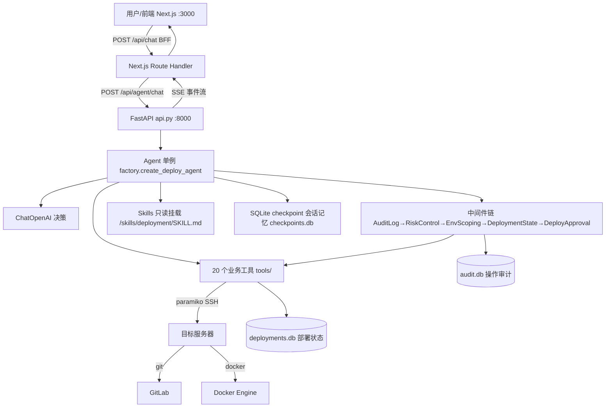

# AI DevOps 总体方案与实现

> 本文档是项目总览：架构、已实现功能、测试、安全、已知问题、优化路线。
> 定位：给后续开发者 / 面试复盘 / 路线决策看的全貌。
> 细分文档：`README.md`（快速开始）、`架构分析文档.md`（架构分析）、`项目运转流程.md`（模块时序详解，**部分已过期，以代码为准**）、`前端规划方案.md`（前端规划）、`AGENTS.md`（给 AI 编码代理的协作说明）、`docs/adr/`（架构决策记录）、`docs/词汇表.md`（通用语言）、`docs/路线图.md`（优化里程碑）。

## 目录

1. [项目概述](#1-项目概述)
2. [总体架构](#2-总体架构)
3. [后端实现](#3-后端实现)
4. [前端实现](#4-前端实现)
5. [安全设计](#5-安全设计)
6. [测试体系](#6-测试体系)
7. [本轮修复记录](#7-本轮修复记录)
8. [已知问题与技术债](#8-已知问题与技术债)
9. [优化路线图](#9-优化路线图)

---

## 1. 项目概述

Agent 驱动的软件自动交付部署系统：用户用自然语言提出部署需求，Agent 按标准 SOP 自动完成「拉代码 → 构建镜像 → 人工审批 → 停旧容器 → 删旧容器 → 起新容器 → 健康检查」，高风险步骤弹窗经人工批准后继续。

| 类别 | 选型 | 用途 |
|---|---|---|
| Agent 框架 | DeepAgents 0.4.x | Agent 核心 + 中间件 + Skills 挂载 |
| 工作流引擎 | LangGraph（内置） | 状态机、checkpoint、interrupt/resume |
| LLM | langchain-openai（OpenAI 兼容协议） | 决策与生成，temperature=0 |
| 后端 | FastAPI + uvicorn | HTTP 接口 + SSE 流式响应 |
| SSH | paramiko（`asyncio.to_thread` 包装） | 目标服务器执行 git/docker |
| 配置 | pydantic-settings | `.env` 加载，敏感字段 `SecretStr` |
| 日志 | loguru | 控制台 + 文件双输出 |
| 前端 | Next.js 16 + React 19 | BFF 代理 + 对话工作台 |
| 测试 | pytest + pytest-asyncio / vitest | 后端 139 用例 / 前端 43 用例 |

## 2. 总体架构

**关键设计**：Agent 本机只编排，git/docker 全经 SSH 在目标服务器执行；会话记忆 SQLite 落盘，重启可续聊；每次工具调用记审计，关键工具执行后自动更新部署状态。

## 3. 后端实现

### 3.1 工具层（20 个，`tools/__init__.py`，`build_tools` 注册 `:2541-2564`）

| 类别 | 工具 | 要点 |
|---|---|---|
| 部署 | `git_pull_code` | workspace 白名单校验，clone/pull 自适应，返回 commit |
| 部署 | `build_docker_image` | 镜像名不在前缀白名单时**自动加入**；build 日志实时进 SSE `build_log` |
| 部署 | `stop/remove/start_container` | container_name 白名单；start 同名容器存在则拒绝 |
| 诊断 | `check_service_health`、`get_container_logs`、`check_server_environment`、`list_containers`、`list_images` | 只读巡检；`get_container_logs` 无白名单校验（注释自认，见 §8） |
| 文件 | `check_dockerfile`、`list/read/write/delete_workspace_file` | workspace + 路径禁 `..`/`.git`，读 ≤1MB、写 ≤256KB |
| 白名单 | `add/remove_whitelist_entry` | 对话中增删容器/镜像白名单，持久化 JSON，删空保护 |
| 状态 | `get_deployment_status`、`list_deployment_history` | 读 deployments 表 |
| 回滚 | `rollback_deployment` | 用历史镜像 stop→rm→run，落 `rolled_back` + `rollback_from` |

工具统一返回结构化 JSON `{"success", "error_type", "message", ...}`，**永不 raise**（LLM 靠它决策）。

### 3.2 中间件链（`factory.py:168-172`，列表**第一个在最外层**）

| 顺序 | 中间件 | 职责 |
|---|---|---|
| 1 | `AuditLogMiddleware`（`:781`） | 每次工具调用记审计：ok / failed / **blocked**（风险控制拒绝）/ error；审批拒绝由审批中间件补记 rejected |
| 2 | `RiskControlMiddleware`（`:604`） | 容器维度并发锁；healthy 容器禁直接删；部署中禁回滚；高风险调用打 warning |
| 3 | `EnvScopingMiddleware`（`:357`） | 已退化为 no-op（参数透传），白名单校验下沉到各 tool 内部 |
| 4 | `DeploymentStateMiddleware`（`:433`） | 工具成功后 upsert 部署状态（commit/image/container/status），失败记 failed+error |
| 5 | `DeployApprovalMiddleware`（`:122`） | `after_model` 扫描审批名单工具，`interrupt()` 等人工决策；approve 保留、reject/edit 移除并追记审计 |

关键实现点：

- **thread_id 提取**（`middleware.py:32` `_thread_id_from_runtime`）：优先 `runtime.execution_info.thread_id`（langgraph 标准字段，由 config 填充），回退 `runtime.context` 字典（测试兼容）。**不要直接读 `runtime.context`**——生产里它是 `RuntimeContext` 模型。
- **`interrupt()` 只能在 after_model**：ToolNode 会静默吞掉 `wrap_tool_call` 里的 `GraphInterrupt`。
- **拒绝状态区分**（`middleware.py:430`）：`risk_blocked` / `concurrency_conflict` → `blocked`，其余失败 → `failed`，审批拒绝 → `rejected`。
- 审批 `edit` 决策暂不支持，按 reject 处理。

### 3.3 API 与 SSE（`api.py`）

| 方法 | 路径 | 行号 | 说明 |
|---|---|---|---|
| GET | `/healthz` | `:260` | 健康检查 |
| GET | `/api/agent/threads` | `:301` | 会话列表 |
| GET | `/api/agent/threads/{id}/messages` | `:353` | 单会话消息历史 |
| GET | `/api/agent/audit` | `:393` | 审计查询（`thread_id` / `tool_name` / `limit` 过滤） |
| DELETE | `/api/agent/threads/{id}` | `:416` | 幂等删除线程检查点 |
| POST | `/api/agent/chat` | `:484` | 对话入口，SSE 流式返回 |

SSE 事件 11 种：`agent_state` / `message_delta` / `tool_call_start` / `tool_call_end` / `task_status` / `log` / `build_log` / `approval_required` / `stream_complete` / `error` + 心跳注释行。HTTP 日志中间件 `log_requests`（`:238`）。

### 3.4 存储

| 库（`backend/checkpoints/`，gitignore） | 表 | 写 / 读 |
|---|---|---|
| `checkpoints.db` | LangGraph checkpoint | 会话记忆，重启可续聊 |
| `deployments.db`（`state.py`） | `deployments`：thread/repo/branch/commit/image/container/environment/status/error/rollback_from | 写：状态中间件；读：状态/历史/回滚工具、RiskControl 前置校验 |
| `audit.db`（`audit.py`） | `audit_log`：thread/tool/风险等级/打码参数/状态/摘要/耗时 | 写：审计中间件 + 审批补记；读：`GET /api/agent/audit` |

### 3.5 配置（`settings.py`，`.env`）

LLM（`OPENAI_API_KEY/BASE_URL/MODEL/TEMPERATURE` + `MODEL_MAX_TOKENS` 缺省 8192 → `build_chat_model`，`factory.py`）、三类白名单（`CONTAINER_NAMES` / `IMAGE_PREFIX` / `WORKSPACES`，容器·镜像支持对话中增删持久化到 `whitelist.json`）、SSH（`SERVER_HOST/PORT/USER/PASSWORD`）、`GITLAB_USER/TOKEN`、`HEALTH_URL`、`APPROVAL_REQUIRED_TOOLS`（缺省 stop/start/rollback，`.env` 配 8 个）、监听 `HOST/PORT`、日志 `LOG_LEVEL/LOG_DIR`。

## 4. 前端实现

- **单页工作台** `app/page.tsx`：Sidebar（历史会话）+ MessageList（含 ToolCard/ThinkingProcess/Markdown）+ ApprovalDialog（审批弹窗）+ TaskStatusBar（9 阶段）+ Composer（输入/中止）。
- **BFF 路由** `app/api/`：`POST/GET chat`（转发 + SSE 透传，驼峰转下划线）、`GET threads`、`GET threads/[id]/messages`、`DELETE threads/[id]`。
- **lib**：`sse-parser`（手动解析、心跳跳过、断流回调）、`api-client`（Abort 中止）、`history-client`（后端记忆合并）、`think-parser`、`text-cleanup`、`logger`、`types`（10 种事件类型）。
- **测试**：`__tests__/` 3 文件 43 用例（sse-parser / history-client / text-cleanup）。
- 前端能力超出原规划：历史会话、历史恢复、多轮续聊（规划明确不做，现已实现）。

## 5. 安全设计

- **白名单纵深防御**：tool 入口硬校验 + RiskControl 前置校验（healthy 禁删、部署中禁回滚）+ 审批闸门三层。
- **密码不进 prompt**：`server_password` / `gitlab_token` / `openai_api_key` 只在 tool 内部使用；日志统一打码（`_mask_args`）。
- **审批闸门**：高风险工具默认需人工批准，单条决策可广播多项，数量不匹配直接报错。
- **并发锁**：同容器部署写操作互斥，占用时直接拒绝（`concurrency_conflict`）不排队。

## 6. 测试体系

- 后端 **139 用例**：`test_tools`（66，参数校验 + mock SSH）、`test_state`（26，状态存储 + 中间件）、`test_rollback`（13）、`test_approval`（10+，审批 + 审计补记）、`test_audit`（4，审计状态 + 查询路由）、`test_skills`（12）、`test_memory_api`（7）、`test_factory`（1）。
- 前端 **43 用例**（vitest）。
- 坑：`test_approve.py` / `test_sse.py` / `test_check_container_and_images.py` 是手工 httpx 脚本（导入即请求 `127.0.0.1:8001`），跑 pytest 必须 `--ignore`；`test_dockerfile.py` 是空文件。详见 `AGENTS.md`。

## 7. 本轮修复记录

1. `middleware.py` 补 `import asyncio` / `import time`（编译通过但运行时 `NameError`）。
2. `RiskControlMiddleware` + `AuditLogMiddleware` 接入 `factory.py`（此前是死代码）；`api.py` lifespan 关闭审计库；补 `__all__`。
3. **thread_id 修复**：生产链路拿不到 thread_id 导致状态跟踪/风险校验/审计关联全部空转，改走 `runtime.execution_info.thread_id`（`middleware.py:32`），一处修复三处生效；回归测试 `test_middleware_tracks_via_execution_info`。
4. **审批拒绝落审计**：`DeployApprovalMiddleware` 经 `_run_approval` 收集拒绝项，`aafter_model` 写 `status=rejected`。
5. **风险拒绝记 `blocked`**：`_BLOCKED_ERROR_TYPES`，不再与工具失败混为 `failed`。
6. **新增 `GET /api/agent/audit`**（`api.py:393`）：`AuditLogStore.list` 此前零调用。
7. **`MODEL_MAX_TOKENS` 接线**：`.env` 配 32768 但被 `extra="ignore"` 丢弃、代码硬编码 8192；现经 `settings.model_max_tokens`（`settings.py:53`）传入模型；回归测试 `test_factory.py`。
8. 新增 `AGENTS.md`（代理协作说明）、`docs/adr/` ×4、`docs/词汇表.md`、`docs/路线图.md`。

## 8. 已知问题与技术债

| # | 项 | 位置 | 性质 |
|---|---|---|---|
| 1 | 文档过期：`项目运转流程.md` 仍写 5 工具/2 中间件/InMemorySaver；`prompts.py` 写“15 个工具”（实际 20） | 文档、`prompts.py:47` | 文档债 |
| 2 | 死配置：`DOCKER_HOST`、`IMAGE_TAG_FORMAT`、`HOST`/`PORT`（仅启动命令用）、`model_ready` 无调用 | `settings.py` | 待清理或接线 |
| 3 | `LogPanel` 组件写了但未挂载；`build_log`/`log` 事件解析后丢弃；`logLines` 无上限 | `frontend/components/LogPanel.tsx`、`app/page.tsx` | 前端未接线 |
| 4 | 审批 `edit` 不支持（按 reject）；`get_container_logs` 无容器白名单校验 | `middleware.py`、tools | 设计降级 |
| 5 | `tests/test_dockerfile.py` 空文件；3 手工脚本破坏全量收集 | `backend/tests/` | 测试债 |
| 6 | 生产部署配置缺失（PM2/systemd） | — | 未实现 |
| 7 | 审批弹窗展示原始 args（规划要求只展示 description） | `ApprovalDialog.tsx` | 与规划差异 |

## 9. 优化路线图

目标岗位 AI 应用/大模型工程，标尺：**Evals、可靠性、成本、自主性**（详见 `docs/adr/ADR-0001`）。

| 里程碑 | 内容 | 完成标准 | 决策 |
|---|---|---|---|
| M1 | Evals（规则断言先行） | 5 指标基线报告产出 | ADR-0002/0003 |
| M2 | LLM 成本可观测（`llm_usage` 表，只记 tokens） | 任意 thread 的 token 明细可查 | ADR-0004 |
| M3 | 待定：故障自愈闭环 / 审批治理升级 | 待定 | 未开始 |

**Evals 方案要点**（ADR-0002/0003）：

- 5 指标：审批召回🔴、SOP 顺序🔴、参数合法率、最终状态正确率、错误如实率（🔴=红线，漏一次拦合并）
- 分层运行：PR 跑命令级 fake 快集（小模型 + golden，拦合并）；nightly 跑本地沙箱全量 + 生产日志回放 + 抽样裁判
- Harness 落点：`backend/tests/evals/`；先出基线报告再优化

**Evals 选型结论**：阶段一自研 harness（5 指标全确定性，框架是多余中间层）；阶段二按需引入 **DeepEval**（pytest 原生 + G-Eval 做裁判抽样）；**Promptfoo** 仅在需要模型对比矩阵/红队时评估；**不引入 LangSmith**（hosted 成本 + 敏感数据外发，audit_log 回放已够用）、**不引入 Ragas**（无检索场景）。

---

*维护说明：改动跨度大或与文档不符时同步更新本文；冲突时以代码为准。*
