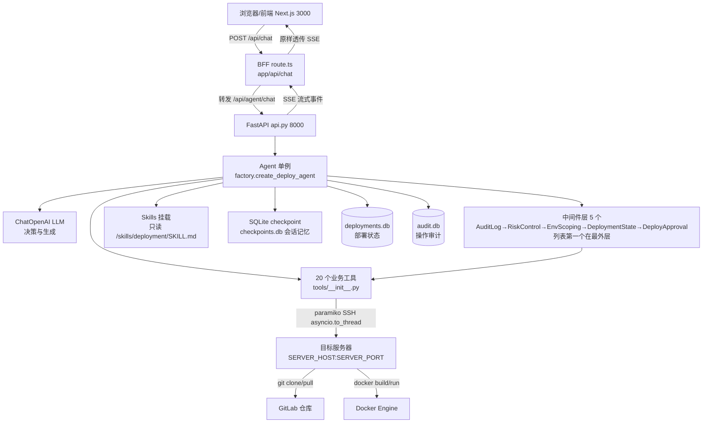
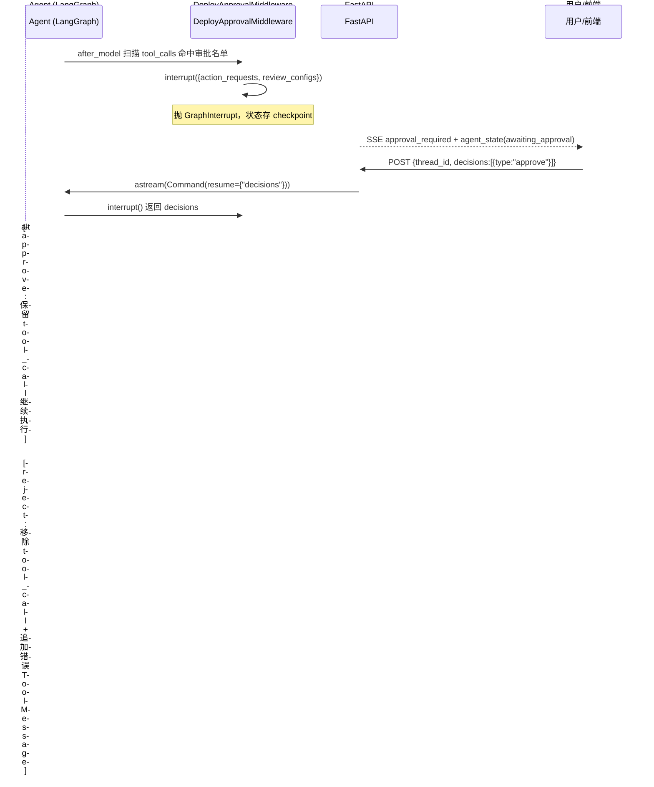

# 自动部署 Agent Demo —— 架构分析文档

> 本文档基于 `ai_devops` 全量源码分析生成，梳理整体架构、逐文件职责、方法/工具清单。
> 与代码冲突时以代码为准（见 `AGENTS.md`）。
> 覆盖后端（backend/，Python + FastAPI + DeepAgents）与前端（frontend/，Next.js + React + TypeScript）两部分。
> 适合作为开发、维护、二次开发的参考手册，配合源码阅读。

---

## 目录

1. [项目概览](#1-项目概览)
2. [整体架构与数据流](#2-整体架构与数据流)
3. [目录结构总览](#3-目录结构总览)
4. [后端文件职责](#4-后端文件职责)
5. [后端方法/函数/工具清单](#5-后端方法函数工具清单)
6. [前端文件职责](#6-前端文件职责)
7. [前端方法/组件清单](#7-前端方法组件清单)
8. [SSE 通信协议](#8-sse-通信协议)
9. [核心机制详解](#9-核心机制详解)
10. [配置项速查表](#10-配置项速查表)
11. [测试覆盖](#11-测试覆盖)
12. [安全设计要点](#12-安全设计要点)
13. [已知限制](#13-已知限制)

---

## 1. 项目概览

### 1.1 项目目标

构建一个 **基于 DeepAgents 框架的部署 Agent**，用户用自然语言提出部署需求后，Agent 自动完成
「代码拉取 → 镜像构建 → 人工审批 → 停旧容器 → 起新容器 → 健康检查」的全流程自动化部署。

### 1.2 技术栈

| 类别 | 选型 | 版本 | 用途 |
|------|------|------|------|
| 后端框架 | FastAPI | >=0.135.2 | HTTP 接口 + SSE 流式响应 |
| Agent 框架 | DeepAgents | 0.4.12 | Agent 核心 + 中间件 + Skills 挂载 |
| 工作流引擎 | LangGraph（DeepAgents 内置） | - | 状态机、checkpoint、interrupt/resume |
| LLM 接入 | langchain-openai | 1.2.1 | ChatOpenAI 兼容 OpenAI 协议模型 |
| SSH 客户端 | paramiko | >=3.5.0 | 远程执行 git/docker 命令 |
| 配置管理 | pydantic-settings | >=2.13.1 | .env 加载 |
| 日志 | loguru | >=0.7.3 | 控制台 + 文件双输出 |
| 测试 | pytest + pytest-asyncio | >=8.0 / >=0.24 | 后端测试 |
| 前端框架 | Next.js (App Router) + React | 16.3.1 / 19.2.8 | 单页对话控制台 |
| 前端语言 | TypeScript | ^5 | 类型安全 |
| 前端测试 | Vitest | ^4.1.11 | SSE 解析/文本清洗纯函数 |
| Markdown 渲染 | react-markdown + remark-gfm | ^10 / ^4 | Agent 回复 GFM 渲染 |

### 1.3 环境基线

- Python >= 3.12.9，依赖由 `uv` 管理（`uv.lock` 锁定）
- 目标服务器：由 `.env` 的 `SERVER_HOST` / `SERVER_PORT` 配置（端口未配置时默认 22）
- 镜像前缀：由 `.env` 的 `IMAGE_PREFIX` 白名单配置（多值，逗号分隔）
- 仓库地址/分支：由用户在对话中指定，**无白名单**（鉴权由系统注入）
- 容器名 / workspace：多值白名单（逗号分隔，改 .env 后重启生效）

---

## 2. 整体架构与数据流

### 2.1 架构总览



### 2.2 一次部署的完整数据流

```text
1. 用户输入部署任务 → 前端 Composer
2. 前端 lib/api-client.postChat → fetch POST /api/chat（驼峰 body）
3. BFF route.ts 转下划线 → 转发后端 /api/agent/chat
4. api.py event_generator 启动 → agent.astream 消费 LangGraph 流
5. Agent 循环：LLM 决策 →（审批中间件 interrupt?）→ 工具 SSH 执行 → ToolMessage 回流
6. api.py 把 stream_mode=[messages, updates] 的 chunk 翻译为 11 种 SSE 事件
7. BFF 原样透传 SSE → 前端 sse-parser 解析 → page.tsx reducer 更新各 UI 区域
8. 高风险工具触发 interrupt → 前端弹审批窗 → 用户决策 → 同 thread_id + decisions 重新 POST → 恢复中断
```

### 2.3 关键设计决策

| 决策 | 说明 |
|------|------|
| Agent 只编排，不执行 | git/docker 全部通过 paramiko SSH 在目标服务器执行，避免本机环境污染 |
| Agent 单例懒加载 | 首次 HTTP 请求才创建（`get_agent()`），启动期不依赖 LLM 可用性 |
| SSE 而非轮询 | HTTP 长连接持续推送事件，`X-Accel-Buffering: no` 禁用 nginx 缓冲 |
| BFF 直连后端 | 前端不直连后端，经 Next.js Route Handler 代理（驼峰→下划线字段映射） |
| interrupt 必须在 after_model | wrap_tool_call 抛 GraphInterrupt 会被 ToolNode 静默吞掉（middleware.py 注释明确） |
| 工具绝不 raise | 所有工具返回结构化 JSON 字符串（`_ok`/`_err`），LLM 可直接解析 |

---

## 3. 目录结构总览

```
ai_devops/
├── AGENTS.md                       # 给 AI 编码代理的协作说明
├── 总体方案实现.md                  # 项目总览（架构/功能/测试/路线）
├── 项目运转流程.md                  # 后端运转流程详解（早期主文档，部分已过期）
├── 前端规划方案.md                   # 前端编码前设计规划
├── Trae任务模板-含日志功能.md         # 任务模板（Step1-3 分解）
├── 架构分析文档.md                   # ← 本文档
├── docs/                           # ADR 决策记录 + 词汇表 + 路线图
│
├── backend/                        # 后端项目根（pyproject.toml 在此）
│   ├── pyproject.toml              # 项目元数据 + 依赖 + pytest 配置
│   ├── uv.lock                     # uv 依赖锁定文件
│   ├── .env                        # 配置（密码/token，已 gitignore）
│   ├── .env.example                # 配置模板
│   ├── README.md                   # 空文档（待补）
│   ├── skills/
│   │   └── deployment/
│   │       └── SKILL.md            # 部署技能文档（Agent 唯一工具参考手册）
│   ├── scripts/
│   │   ├── smoke_test.py           # SSE 冒烟测试脚本
│   │   ├── inspect_db.py           # 查看 checkpoints.db 表结构
│   │   └── inspect_thread.py       # 查看指定线程检查点
│   ├── src/
│   │   └── deploy_agent/
│   │       ├── __init__.py         # 包入口，导出各子模块
│   │       ├── api.py              # FastAPI 接口 + SSE 事件流翻译
│   │       ├── factory.py          # Agent 装配工厂
│   │       ├── middleware.py       # 5 个中间件（审计/风控/透传/状态/审批）
│   │       ├── state.py            # deployments 表（部署状态存储）
│   │       ├── audit.py            # audit_log 表（操作审计存储）
│   │       ├── prompts.py          # 系统提示词模板与渲染
│   │       ├── runtime.py          # RuntimeContext 运行时上下文 schema
│   │       ├── settings.py         # .env 配置加载
│   │       ├── logging.py          # loguru 日志配置
│   │       └── tools/
│   │           └── __init__.py     # 20 个业务工具（SSH 执行）
│   ├── tests/
│   │   ├── __init__.py
│   │   ├── test_tools.py           # 工具单元测试（66）
│   │   ├── test_state.py           # 部署状态存储与中间件（26）
│   │   ├── test_rollback.py        # 回滚工具与落库（13）
│   │   ├── test_approval.py        # 审批中间件 + 审计补记（10）
│   │   ├── test_audit.py           # 审计状态 + 查询路由（4）
│   │   ├── test_factory.py         # 模型构建 max_tokens（1）
│   │   ├── test_memory_api.py      # 记忆查询纯函数（7）
│   │   ├── test_skills.py          # Skills 挂载测试（12）
│   │   ├── test_sse.py             # 手动联调脚本（非 pytest，收集会失败，跑测试需 --ignore）
│   │   ├── test_approve.py         # 手动审批恢复脚本（非 pytest，同上）
│   │   ├── test_check_container_and_images.py  # 手动联调脚本（非 pytest，同上）
│   │   └── test_dockerfile.py      # 空文件（占位）
│   ├── checkpoints/                # SQLite 落盘（gitignore）：checkpoints.db / deployments.db / audit.db
│   └── logs/
│       └── deploy_agent.log        # 运行时日志（50MB 轮转）
│
└── frontend/                       # 前端项目根
    ├── package.json                # 依赖与脚本
    ├── package-lock.json
    ├── tsconfig.json               # TypeScript 配置
    ├── next.config.ts              # Next.js 配置（空）
    ├── next-env.d.ts
    ├── eslint.config.mjs           # ESLint 配置
    ├── .env.development            # 前端开发环境变量
    ├── .gitignore
    ├── README.md                   # create-next-app 默认 README
    ├── AGENTS.md                   # Next.js 自动生成的 agent 规则提示
    ├── CLAUDE.md                   # 引用 AGENTS.md
    ├── app/
    │   ├── layout.tsx              # 根布局
    │   ├── page.tsx                # 对话主页面（状态机 + 事件分发）
    │   ├── page.module.css
    │   ├── globals.css
    │   ├── favicon.ico
    │   └── api/
    │       ├── chat/
    │       │   └── route.ts        # BFF 聊天代理路由
    │       └── threads/
    │           ├── route.ts        # BFF 线程列表代理
    │           └── [threadId]/
    │               ├── route.ts    # BFF 删除线程代理
    │               └── messages/
    │                   └── route.ts  # BFF 消息历史代理
    ├── components/
    │   ├── Sidebar.tsx             # 历史会话侧边栏
    │   ├── MessageList.tsx         # 消息区
    │   ├── ToolCard.tsx            # 工具卡片
    │   ├── LogPanel.tsx            # 日志区（已实现但未挂载，见 §13）
    │   ├── ApprovalDialog.tsx      # 审批弹窗
    │   ├── TaskStatusBar.tsx       # 状态条
    │   ├── Composer.tsx            # 发送框
    │   ├── ThinkingProcess.tsx     # 思考过程折叠卡片
    │   ├── MarkdownText.tsx        # Markdown 渲染
    │   └── *.module.css            # 各组件 CSS Module
    ├── lib/
    │   ├── types.ts                # 10 种 SSE 事件类型定义
    │   ├── sse-parser.ts           # SSE 流式解析器
    │   ├── api-client.ts           # fetch + SSE 消费封装
    │   ├── history-client.ts       # 后端记忆客户端（线程/消息/删除）
    │   ├── think-parser.ts         # <think> 解析
    │   ├── logger.ts               # 前端日志器
    │   └── text-cleanup.ts         # 回复文本清洗（剥工具结果 JSON）
    ├── __tests__/
    │   ├── sse-parser.test.ts      # SSE 解析器测试（23）
    │   ├── history-client.test.ts  # 记忆客户端测试（10）
    │   └── text-cleanup.test.ts    # 文本清洗测试（10）
    └── public/                     # 静态资源（next/vercel/globe/window/file.svg）
```

---

## 4. 后端文件职责

### 4.1 `pyproject.toml`

- 项目元数据：`name = "deploy-agent"`，`version = "0.1.0"`，Python >= 3.12.9
- 核心依赖（uv 管理）：deepagents、fastapi[standard]、langchain-core、langchain-openai、pydantic-settings、httpx、loguru、uvicorn、paramiko
- dev 依赖：pytest、pytest-asyncio
- 配置了清华镜像源（`mirrors.tuna.tsinghua.edu.cn`）
- pytest 配置：`asyncio_mode = "auto"`（async 测试免装饰器）、`testpaths = ["tests"]`

### 4.2 `src/deploy_agent/__init__.py`

- 包入口，导出 `factory / logging / middleware / prompts / runtime / settings / tools` 子模块
- 提供 `main()` 占位（打印 "Hello from deploy-agent!"）

### 4.3 `src/deploy_agent/settings.py`

- `Settings` 类：继承 `pydantic_settings.BaseSettings`，从 `.env` 加载全部配置
- 字段覆盖：LLM（openai_*）、GitLab 鉴权（gitlab_*）、SSH 服务器（server_*）、白名单（container_names / image_prefixes / workspaces）、健康检查、审批名单、服务监听、日志
- 敏感字段（openai_api_key / gitlab_token / server_password）用 `SecretStr`
- `settings_customise_sources`：`.env` 存在时优先于 shell 环境变量
- `model_post_init`：加载 `whitelist.json` 覆盖容器/镜像白名单的 .env 初始值
- `get_settings()`：`@lru_cache(maxsize=1)` 单例

### 4.4 `src/deploy_agent/runtime.py`

- `RuntimeContext`（pydantic BaseModel）：单次部署任务的运行时上下文（container_name / image_tag / environment / user_id / additional_info）
- 三个辅助函数：`coerce_runtime_context`（归一化）、`runtime_context_to_config`（序列化入 checkpoint）、`render_runtime_context_block`（渲染为 prompt 文本块）

### 4.5 `src/deploy_agent/factory.py`

- `build_chat_model(settings)`：构建 ChatOpenAI，禁用 thinking、`max_tokens` 从 `settings.model_max_tokens` 读取（`.env` 的 `MODEL_MAX_TOKENS`，缺省 8192）
- `_build_deploy_backend()`：CompositeBackend 挂载 FilesystemBackend，把 `backend/skills/` 虚拟挂载到 `/skills/`（只读）
- `build_default_checkpointer()`：SQLite 持久化检查点（`checkpoints/checkpoints.db`），重启可续聊
- `create_deploy_agent(settings, checkpointer)`：调 `create_deep_agent` 总装 Agent
  - 注册五个中间件（列表第一个在最外层）：`AuditLogMiddleware` → `RiskControlMiddleware` → `EnvScopingMiddleware` → `DeploymentStateMiddleware` → `DeployApprovalMiddleware`
  - 挂载 skills、注入系统提示词、`context_schema=RuntimeContext`

### 4.6 `src/deploy_agent/middleware.py`

- `DeployApprovalMiddleware`：审批中间件（核心）
  - `after_model` / `aafter_model` 扫描 AIMessage.tool_calls，命中审批名单则 `interrupt()`
  - `_process_decision` 处理 approve / reject / edit（edit 按 reject 处理）
  - 单条决策广播、决策数量校验
  - `_run_approval` 返回（状态更新，被拒绝项）；`aafter_model` 经 `_record_rejections` 把 reject/edit 补记审计（status=rejected）
- `RiskControlMiddleware`：风险控制——容器维度 asyncio 并发锁；healthy 容器禁直接删；部署中禁回滚；高风险调用打 warning；拒绝返回同构错误 JSON（`risk_blocked` / `concurrency_conflict`），短路不进状态跟踪
- `EnvScopingMiddleware`：环境作用域中间件（参数透传，校验已下沉到工具内部，方法体为空保留结构）
- `DeploymentStateMiddleware`：工具执行后自动 upsert 部署状态（成功迁移状态，失败记 failed+error）
- `AuditLogMiddleware`：每次工具调用记审计（ok / failed / blocked / error，打码参数 + 耗时）
- 常量：`_TOOL_RISK_LEVELS`（工具风险分级）、`_BLOCKED_ERROR_TYPES`（记 blocked 的 error_type）
- 辅助函数：`_thread_id_from_runtime`（优先 `runtime.execution_info.thread_id`，回退 context 字典）、`_extract_tool_message_text`、`_append_ai_message_text`、`_mask_args`、`_build_action_description`

### 4.7 `src/deploy_agent/state.py`（新增）

- `DeploymentStateStore`：`deployments` 表（thread_id / repo_url / branch / commit / image / container / environment / status / error / rollback_from / created_at / updated_at）
- 方法：`record`（upsert）、`get_by_thread`、`get_by_id`、`latest_by_container`、`list_history`
- `get_deployment_store()` 单例 + `close_deployment_store()`（lifespan 关闭）

### 4.8 `src/deploy_agent/audit.py`（新增）

- `AuditLogStore`：`audit_log` 表（thread_id / tool_name / risk_level / args_summary / status / result_summary / elapsed_ms / created_at）
- 合法状态 `AUDIT_STATUSES = (ok, failed, rejected, blocked, error)`，风险等级 `RISK_LEVELS = (low, medium, high)`
- 方法：`record`、`list`（thread_id / tool_name / limit 过滤）
- `get_audit_store()` 单例 + `close_audit_store()`（lifespan 关闭）

### 4.9 `src/deploy_agent/prompts.py`

- `DEPLOY_AGENT_SYSTEM_PROMPT`：系统提示词模板（占位符 `{server_host} {image_prefixes} {container_names} {workspaces}`）
- `render_system_prompt(settings)`：注入目标环境事实，返回最终提示词（密码/令牌绝不注入）
- 提示词内容：角色边界、指令前置校验、环境事实、读 SKILL.md 强制规则、部署顺序约束、错误处理、全中文输出

### 4.10 `src/deploy_agent/logging.py`

- `configure_logging()`：配置 loguru（控制台 stderr + 文件轮转 50MB 保留 7 份），幂等
- 模块导入时自动调用一次
- 读取 LOG_LEVEL / LOG_DIR 时做降级（settings 失败退回环境变量 + 默认值）

### 4.11 `src/deploy_agent/api.py`

- FastAPI 应用入口（`app = FastAPI(title="deploy-agent")`）
- `POST /api/agent/chat`：SSE 事件流主接口（新对话 / 审批恢复）
- `GET /healthz`：健康检查
- `GET /api/agent/threads`：会话列表；`GET /api/agent/threads/{id}/messages`：单会话历史；`DELETE /api/agent/threads/{id}`：幂等删除检查点
- `GET /api/agent/audit`：审计查询（`thread_id` / `tool_name` / `limit` 过滤）
- `log_requests` HTTP 中间件：记录 method/path/status/耗时/thread_id
- `lifespan`：退出时关闭检查点、部署状态库、审计库连接
- `get_agent()`：Agent 单例（懒加载）
- 11 种 SSE 事件的翻译逻辑（producer/consumer 模式 + 心跳保活 + build 实时日志队列）
- 常量：`TOOL_STATUS_MAP`（9 项）、`TOOL_HINT_MAP`（13 项）、`_LOG_CHUNK_SIZE=80`、`_HEARTBEAT_INTERVAL=15`

### 4.12 `src/deploy_agent/tools/__init__.py`

- 20 个业务工具（全部闭包工厂模式 + `@tool` async 装饰 + SSH 执行）
- 公共辅助：`_mask`（打码）、`_ok`/`_err`（结构化 JSON）、`_elapsed_ms`、`_build_repo_url_with_auth`（注入鉴权）、`_run_ssh`（paramiko + asyncio.to_thread）、`_cmd_summary`、`_find_dockerfile`、`_parse_ls_output`、`_validate_workspace_subpath`、`_persist_whitelist_json`、`set_build_log_queue`（build 实时日志队列，ContextVar）
- 白名单读写带 `_whitelist_lock` 全局锁（防并发写盘撕裂）
- `build_tools(settings)`：汇总返回 20 个工具列表

### 4.13 `skills/deployment/SKILL.md`

- Agent 唯一技能参考手册（647 行）
- 每个工具一节：用途 / 参数表 / 调用示例 / 返回示例 / 常见错误
- 标准部署 SOP 章节：拉代码 → 确认 Dockerfile → 构建 → 审批闸门 → 停 → 删 → 起 → 健康检查
- 顺序硬约束 + 错误处理规则

### 4.14 `scripts/` 辅助脚本

- `smoke_test.py`：SSE 冒烟测试，httpx 流式 POST `/api/agent/chat`，打印所有 SSE 事件（`_preview_event` 格式化）
- `inspect_db.py`：直连 `checkpoints/checkpoints.db` 查看表结构
- `inspect_thread.py`：查看指定线程的检查点内容

---

## 5. 后端方法/函数/工具清单

### 5.1 20 个业务工具（build_tools 汇总）

> 需审批列按当前 `.env` 的 `APPROVAL_REQUIRED_TOOLS`（8 个）：stop/remove/start_container + write/delete_workspace_file + add/remove_whitelist_entry + rollback_deployment。

| # | 工具名 | 类别 | 需审批 | 白名单校验 | SSH 执行 | 返回要点 |
|---|--------|------|--------|-----------|---------|---------|
| 1 | `git_pull_code` | 部署 | 否 | workspace ∈ workspaces | clone 或 checkout+pull | success, branch, commit |
| 2 | `build_docker_image` | 部署 | 否 | image_name 命中 image_prefixes；不命中自动加入白名单 | docker build（日志实时进 build_log） | success, image, log |
| 3 | `stop_container` | 部署 | 是 | container_name ∈ container_names（不在则拒绝） | docker stop | success, container_name |
| 4 | `remove_container` | 部署 | 是 | container_name ∈ container_names（不在则拒绝） | docker rm -f | success, container_name |
| 5 | `start_container` | 部署 | 是 | container_name 不在白名单自动加入；image 前缀不命中则拒绝 | docker run -d（同名已存在则拒绝） | success, container_name, image |
| 6 | `check_service_health` | 巡检 | 否 | - | docker inspect + curl | status, container_status, http_status |
| 7 | `list_containers` | 巡检 | 否 | - | docker ps | containers[], count |
| 8 | `list_images` | 巡检 | 否 | - | docker images | images[], count |
| 9 | `check_dockerfile` | 巡检 | 否 | code_path ∈ workspaces | 查 Dockerfile 位置 | has_dockerfile, found_path, hint |
| 10 | `list_workspace_files` | 文件 | 否 | workspace + subdir 防 `..` | ls -la | files[], count |
| 11 | `read_workspace_file` | 文件 | 否 | workspace + 相对路径防 `..` | cat（>1MB 拒绝） | content, size, target |
| 12 | `write_workspace_file` | 文件 | 是 | workspace + 防 `..` + 防 .git | base64 写入（≤256KB） | target, bytes_written |
| 13 | `delete_workspace_file` | 文件 | 是 | workspace + 防 `..` + 防 .git | rm -f（只删文件） | deleted |
| 14 | `add_whitelist_entry` | 白名单 | 是 | scope ∈ {container, image} | 内存 + whitelist.json | added, whitelist |
| 15 | `remove_whitelist_entry` | 白名单 | 是 | 禁止删空 | 内存 + whitelist.json | removed, whitelist |
| 16 | `check_server_environment` | 巡检 | 否 | 无参数 | docker/git 版本 + 磁盘 + 内存 | docker_version, git_version, disk, memory |
| 17 | `get_container_logs` | 诊断 | 否 | 仅非空校验（**无容器白名单**，由调用方保证） | docker logs | logs |
| 18 | `get_deployment_status` | 状态 | 否 | thread_id 非空 | 读 deployments 表 | 部署记录 |
| 19 | `list_deployment_history` | 状态 | 否 | limit 1~100 | 读 deployments 表 | 历史列表 |
| 20 | `rollback_deployment` | 回滚 | 是 | 目标容器 ∈ container_names | stop→rm→run 历史镜像 | success, container, image, rollback_from |

### 5.2 tools/__init__.py 公共辅助函数

| 函数 | 职责 |
|------|------|
| `_mask(secret)` | 敏感信息打码（首尾 2 字符） |
| `_ok(**fields)` / `_err(error_type, message, **extra)` | 结构化成功/失败 JSON 字符串 |
| `_elapsed_ms(start)` | 耗时计算（毫秒） |
| `_build_repo_url_with_auth(repo_url, settings)` | 把 gitlab_user:token 注入 repo_url |
| `_run_ssh(settings, command, timeout)` | paramiko SSH 执行（asyncio.to_thread 包裹），返回 (exit_code, stdout, stderr) |
| `_cmd_summary(cmd, max_len)` | 命令摘要（截断，不含密码） |
| `_find_dockerfile(settings, code_path, tool_name)` | 依次查根目录与 docker/ 子目录的 Dockerfile |
| `_parse_ls_output(output)` | 解析 `ls -la --time-style=long-iso` 输出为结构化列表 |
| `_validate_workspace_subpath(workspace, file_path, settings, protect_git)` | workspace 白名单 + 相对路径/`..`/.git 校验 |
| `_persist_whitelist_json(settings, path)` | 容器/镜像白名单双写 whitelist.json |

### 5.3 api.py 函数清单

| 函数/对象 | 职责 |
|-----------|------|
| `ChatRequest` / `HealthResponse` | Pydantic 请求/响应模型 |
| `_sse_event(event, data)` | 构造 SSE 事件字符串 |
| `_safe_get(d, *keys)` | 安全嵌套取值 |
| `_extract_text_from_message(message)` | 从 LangChain Message 提取文本 |
| `_extract_tool_calls(message)` | 从 AIMessage 提取 tool_calls |
| `_split_log_to_chunks(log_text, chunk_size)` | 长 log 切 80 字符片段 |
| `_build_action_request_from_interrupt(interrupt_obj)` | 从 interrupt 提取 action_requests/review_configs |
| `log_requests(request, call_next)` | HTTP 请求日志中间件 |
| `healthz()` | GET /healthz |
| `get_agent()` | Agent 单例（懒加载） |
| `agent_chat(req)` | POST /api/agent/chat 主接口 |
| `event_generator()` | SSE 事件生成器（核心） |
| `_producer()` | 独立消费 astream 的 producer |
| `list_threads()` | GET /api/agent/threads 会话列表 |
| `get_thread_messages(thread_id)` | GET 单会话消息历史（404 结构化错误） |
| `delete_thread(thread_id)` | DELETE 幂等删除线程检查点 |
| `list_audit(thread_id, tool_name, limit)` | GET /api/agent/audit 审计查询 |
| `lifespan(app)` | 退出时关闭检查点/状态库/审计库连接 |

### 5.4 middleware.py 函数清单

| 函数/方法 | 职责 |
|-----------|------|
| `_thread_id_from_runtime(runtime)` | 优先 `execution_info.thread_id`，回退 context 字典 |
| `_extract_tool_message_text(message)` | 提取 ToolMessage 文本 |
| `_append_ai_message_text(message, text)` | 向 AIMessage 追加文本 |
| `_mask_args(args)` | 参数摘要打码 |
| `_build_action_description(tool_call)` | 生成审批中文描述 |
| `_TOOL_RISK_LEVELS` / `_BLOCKED_ERROR_TYPES` | 工具风险分级 / 记 blocked 的 error_type |
| `DeployApprovalMiddleware.after_model()` | 同步路径（审批不落审计） |
| `DeployApprovalMiddleware._run_approval()` | 审批主体，返回（状态更新，被拒绝项） |
| `DeployApprovalMiddleware._record_rejections()` | 拒绝补记审计（status=rejected） |
| `DeployApprovalMiddleware.aafter_model()` | 异步路径（落审计，图实际走此分支） |
| `DeployApprovalMiddleware._build_action_request()` | 构造单个 action_request |
| `DeployApprovalMiddleware._process_decision()` | 处理 approve/reject/edit |
| `RiskControlMiddleware.awrap_tool_call()` | 并发锁 + 前置校验 + 高风险日志 |
| `RiskControlMiddleware._precheck()` | remove-healthy / rollback-进行中拦截 |
| `RiskControlMiddleware._lock_key()` | 锁键（容器名，rollback 退回 deployment_id） |
| `DeploymentStateMiddleware.awrap_tool_call()` | 执行后跟踪状态 |
| `DeploymentStateMiddleware._track()` / `_status_for()` / `_fields_for()` | 解析结果 upsert deployments |
| `AuditLogMiddleware.awrap_tool_call()` | 记录审计（含异常 error 分支） |
| `AuditLogMiddleware._summarize_result()` | 结果 → ok/failed/blocked |
| `EnvScopingMiddleware.wrap_tool_call()` / `awrap_tool_call()` | 参数透传（空实现） |

### 5.5 factory.py 函数清单

| 函数 | 职责 |
|------|------|
| `build_chat_model(settings)` | 构建 ChatOpenAI（禁用 thinking，max_tokens 从 settings.model_max_tokens 读） |
| `_build_deploy_backend()` | CompositeBackend 挂载 skills |
| `create_deploy_agent(settings, checkpointer)` | 总装 Agent |

### 5.6 runtime.py / settings.py / prompts.py 函数清单

| 函数 | 职责 |
|------|------|
| `coerce_runtime_context(value)` | 归一化 RuntimeContext |
| `runtime_context_to_config(value)` | 序列化入 checkpoint |
| `render_runtime_context_block(value)` | 渲染 prompt 文本块 |
| `get_settings()` | 单例获取 Settings |
| `Settings.settings_customise_sources()` | 配置加载源优先级 |
| `Settings.model_post_init()` | 加载 whitelist.json |
| `Settings.approval_required_tools()` / `approval_tool_names()` | 审批名单解析 |
| `Settings.container_names` / `image_prefixes` / `workspaces` | 白名单解析属性 |
| `Settings.model_max_tokens` | 模型最大输出（`MODEL_MAX_TOKENS`，缺省 8192） |
| `render_system_prompt(settings)` | 渲染系统提示词 |

---

## 6. 前端文件职责

### 6.1 `package.json`

- 脚本：`dev`（next dev）、`build`、`start`、`lint`（eslint）、`test`（vitest run）、`test:watch`
- 依赖：next、react、react-dom、react-markdown、remark-gfm
- devDependencies：typescript、eslint、vitest、@types/*

### 6.2 `app/layout.tsx`

- 根布局：引入 Geist 字体 + globals.css，配置 metadata（title "自动部署 Agent Demo"）

### 6.3 `app/page.tsx`（核心）

- `useReducer` 状态机管理全部页面状态
- `ChatState`：messages / toolCards / logLines / systemNotes / approval / taskStatus / agentState / threadId / sending / toolLastOk / errorMessage
- `ChatAction`：21 种动作类型
- `reducer`：处理所有动作的状态迁移
- `handleEvent`：SSE 事件分发（10 种事件 → dispatch 对应 action；`build_log` 解析后直接忽略）
- `sendMessage`：发送新消息
- `decideApproval`：审批决策提交（reject 本地置 REJECTED）
- 历史会话：Sidebar（localStorage 会话壳）+ 后端记忆合并/删除同步（`history-client.ts`）
- 布局：header（标题 + 新建会话 + 状态徽章）→ TaskStatusBar → main（消息区 + 工具调用区）→ Composer → ApprovalDialog（LogPanel 已实现但未挂载，log 事件只进内存 `logLines` 不展示）

### 6.4 `app/api/chat/route.ts`（BFF 代理）

- `POST`：接收前端驼峰 body → 转下划线 → 转发后端 → 原样透传 SSE 流
- 参数校验：新会话必须有 message；审批恢复必须有 thread_id
- 错误处理：JSON 解析失败 400、后端不可达 502、非 2xx 透传状态码
- `GET`：后端健康检查（探活 /healthz）
- 地址：`process.env.AGENT_API_URL`（默认 `http://127.0.0.1:8000`）

### 6.5 `lib/types.ts`

- 10 种 SSE 事件 TypeScript interface + `SseEvent` 联合类型（9 种 + `build_log`）
- 辅助类型：`ActionRequest`、`ReviewConfig`
- 设计原则：`tool_call_end.result` 为 unknown；`task_status.status` 用 string（不强耦合后端枚举）

### 6.6 `lib/sse-parser.ts`

- `parseEventBlock(block)`：解析单条 SSE 事件块（导出供测试）
- `parseSseStream(stream, onEvent, onParseSkip, inactivityTimeoutMs)`：流式增量解析
- `EVENT_TYPE_MAP`：后端 event 名 → 前端 type 映射
- 处理：`\n\n` 切块、心跳注释行跳过、坏 JSON/未知事件跳过不中断、活动超时、尾部残留块
- `isEventLikeBlock(block)`：判断是否为事件块

### 6.7 `lib/api-client.ts`

- `postChat(body, options)`：主入口，封装 fetch + SSE 消费，返回 `PostChatHandle { abort }`
- `toBackendBody(body)`：驼峰 → 下划线
- 选项回调：onEvent / onStreamError / onStreamClose / onParseSkip
- 常量：`INACTIVITY_TIMEOUT_MS = 60_000`
- 处理 AbortError（用户取消）、断流判定

### 6.8 `lib/logger.ts`

- `createLogger(module)`：创建模块作用域 logger
- 级别：trace/debug/info/warn/error；dev 下 debug 及以上，prod 下 info 及以上
- `emit`：统一输出入口（switch 调用 console 方法）

### 6.9 `lib/text-cleanup.ts`

- `stripToolResultJson(text)`：剥离回复文本中混入的工具结果 JSON（含布尔 success 字段的块）
- 辅助：`findJsonBlockEnd`（括号配对 + 引号/转义感知）、`isToolResultJson`

### 6.10 组件清单

| 组件 | 职责 | 关键点 |
|------|------|--------|
| `Sidebar` | 历史会话侧边栏 | 新建/切换/删除，localStorage 会话壳 + 后端合并 |
| `MessageList` | 消息区 | 用户右对齐/Agent 左对齐；streaming 光标；错误横幅；内嵌 ToolCard/ThinkingProcess/MarkdownText |
| `ToolCard` | 工具卡片 | pending/success/failed；参数/结果折叠；`isResultSuccess` 判断；图标映射 |
| `ThinkingProcess` | 思考过程折叠卡片 | 解析 `<think>` 块 |
| `LogPanel` | 日志区 | **已实现但未被 page.tsx 挂载**；log 事件滚动 + 自动滚底 + 清空；系统提示固定顶部 |
| `ApprovalDialog` | 审批弹窗 | 逐条列 action_requests；批准/拒绝；等待态；决策数量 = action_requests 数量 |
| `TaskStatusBar` | 状态条 | 9 个阶段 + INIT + 终态（SUCCESS/FAILED/REJECTED） |
| `Composer` | 发送框 | Enter 发送（中文输入法 isComposing 保护）；disabled 控制 |
| `MarkdownText` | Markdown 渲染 | react-markdown + remarkGfm + stripToolResultJson |

### 6.11 测试文件

| 文件 | 覆盖 |
|------|------|
| `__tests__/sse-parser.test.ts` | 10 种事件解析（含 build_log）、心跳、坏 JSON 容错、流式分块、超时、tail 残留、审批恢复时序（23） |
| `__tests__/history-client.test.ts` | 404→ThreadNotFoundError、失败处理、线程列表、消息转换（10） |
| `__tests__/text-cleanup.test.ts` | 工具结果 JSON 剥离的 10 个用例（10） |

### 6.12 `app/api/threads/*`（BFF 记忆代理，新增）

- `GET /api/threads`：转发后端线程列表
- `GET /api/threads/[threadId]/messages`：转发单线程消息历史（404 透传）
- `DELETE /api/threads/[threadId]`：转发删除线程检查点

### 6.13 `lib/history-client.ts`（新增）+ `lib/think-parser.ts`（新增）

- `history-client`：后端记忆客户端——线程列表/消息拉取/删除、404→ThreadNotFoundError、前后端消息格式转换
- `think-parser`：解析 `<think>...</think>`，拆分思考过程与最终回答

---

## 7. 前端方法/组件清单

### 7.1 page.tsx 状态机

**状态字段**：`messages` / `toolCards` / `logLines` / `systemNotes` / `idSeq` / `approval` / `approvalWaiting` / `taskStatus` / `agentState` / `threadId` / `sending` / `toolLastOk` / `errorMessage`

**21 种 Action**：

| Action | 用途 |
|--------|------|
| `sessionReset` | 新建会话重置 |
| `sendStart` | 发送开始 |
| `userMessage` | 追加用户消息 |
| `assistantDelta` | 流式追加文本 |
| `assistantFinal` | 保存最终文本 |
| `toolStart` / `toolEnd` | 工具卡片增/改 |
| `taskStatus` | 更新阶段 |
| `appendLog` / `appendSystemNote` / `clearLogs` | 日志区 |
| `approvalRequired` / `approvalSubmitting` / `approvalResolved` | 审批流程 |
| `setThreadId` / `agentState` | 会话/状态 |
| `rejectedLocally` | 本地拒绝标记 |
| `streamComplete` / `runFailed` | 终态 |

**事件分发映射**：agent_state → setThreadId+agentState；message_delta → assistantDelta；tool_call_start → toolStart；tool_call_end → toolEnd；task_status → taskStatus；log → appendLog（仅内存，不展示）；build_log → 忽略；approval_required → approvalRequired；stream_complete → assistantFinal+streamComplete；error → appendSystemNote+runFailed

---

## 8. SSE 通信协议

### 8.1 HTTP 接口

| 方法 | 路径 | 请求体 | 响应 |
|------|------|--------|------|
| POST | `/api/agent/chat`（后端） | `{message?, thread_id?, decisions?}` | SSE 流 |
| POST | `/api/chat`（前端 BFF） | `{message?, threadId?, decisions?}`（驼峰） | SSE 流（透传） |
| GET | `/healthz`（后端） | 无 | `{status: "ok"}` |
| GET | `/api/chat`（前端 BFF） | 无 | 后端健康状态 |
| GET | `/api/agent/threads`（后端） | 无 | `{success, threads[]}` |
| GET | `/api/agent/threads/{id}/messages`（后端） | 无 | `{success, thread_id, messages[]}`（404 线程不存在） |
| DELETE | `/api/agent/threads/{id}`（后端） | 无 | 幂等删除 |
| GET | `/api/agent/audit`（后端） | `thread_id? tool_name? limit?` | `{success, records[], count}` |
| GET/DELETE | `/api/threads*`（前端 BFF） | 同名转发 | 透传后端记忆接口（审计接口暂无 BFF 代理） |

### 8.2 11 种 SSE 事件（10 种业务 + 心跳注释行）

| event | 触发时机 | 关键字段 | 前端处理 |
|-------|---------|---------|---------|
| `agent_state` | Agent 状态变化 | `status: running/awaiting_approval/completed` | 更新状态徽章 |
| `message_delta` | LLM 文本增量 | `text` | 流式追加消息 |
| `tool_call_start` | LLM 决定调工具 | `name, args, call_id, hint` | 插入工具卡片（pending） |
| `tool_call_end` | 工具执行完成 | `name, result, call_id` | 更新卡片（看 result.success） |
| `task_status` | 工具对应阶段 | `status, tool` | 更新状态条 |
| `log` | log 字段切片 | `tool, text`（每 80 字符） | 只进内存 `logLines`，**不展示**（LogPanel 未挂载） |
| `build_log` | docker build 实时行 | `text` | 解析后**直接忽略** |
| `approval_required` | 需要审批 | `action_requests, review_configs` | 弹审批窗 |
| `stream_complete` | 流正常结束 | `final_result` | 显示最终结果 |
| `error` | 流异常 | `message` | 错误提示 |

### 8.3 task_status 枚举（TOOL_STATUS_MAP）

```
GIT_PULL → BUILD_IMAGE → STOP_CONTAINER → REMOVE_CONTAINER → START_CONTAINER
→ HEALTH_CHECK → LIST_CONTAINERS → LIST_IMAGES → CHECK_DOCKERFILE
```

### 8.4 心跳保活

- 后端 15 秒无数据发 `: keepalive\n\n`（SSE 注释行，前端解析器跳过）
- 前端 60 秒无任何数据（含心跳）判定断流，取消流并报错

---

## 9. 核心机制详解

### 9.1 人工审批（Human-in-the-loop）



关键设计：
- `interrupt()` 必须在 `after_model`（不在 wrap_tool_call，否则 GraphInterrupt 被 ToolNode 吞掉）
- reject 把拒绝原因追加到 AIMessage，避免孤儿 ToolMessage 协议错误
- 单条决策可广播到多个中断项
- 决策数量必须匹配，否则抛 ValueError
- reject/edit 经 `_record_rejections` 补记审计（status=rejected），approve 的工具执行后由审计中间件记 ok/failed

### 9.2 白名单体系

| 白名单 | 校验位置 | 变更方式 |
|--------|---------|---------|
| `container_names`（容器名） | stop/remove/start_container 工具内部 | 改 .env 或 add/remove_whitelist_entry（需审批，持久化到 whitelist.json） |
| `image_prefixes`（镜像前缀） | build/start_container 工具内部 | 同上 |
| `workspaces`（工作目录） | git_pull_code / check_dockerfile / 文件工具 | 仅改 .env（不支持对话变更） |

- 白名单持久化：`whitelist.json` 存在时优先于 .env（`Settings.model_post_init` 加载）
- 增删工具带全局锁 `_whitelist_lock` 防并发写；写盘失败回滚内存

### 9.3 SSH 执行

- 所有工具通过 `_run_ssh`（paramiko）在目标服务器执行
- `asyncio.to_thread` 包裹阻塞调用，避免卡事件循环
- 每次命令新建连接（简化实现）
- 所有命令输出回传前端（log 事件）

### 9.4 文件操作安全

- `_validate_workspace_subpath`：workspace 必须在白名单、file_path 禁止绝对路径 / `..` / `.git/`
- 写文件用 base64 编码防 shell 注入，≤256KB
- 读文件 >1MB 拒绝

### 9.5 Agent 装配

- `create_deep_agent(name, model, tools, system_prompt, context_schema, checkpointer, middleware, skills, backend)`
- 中间件列表第一个在最外层：`AuditLog → RiskControl → EnvScoping → DeploymentState → DeployApproval`（审计需捕获风控拒绝；风控需在状态跟踪之外短路）
- Skills 通过 CompositeBackend 虚拟挂载 `/skills/`（只读）
- 系统提示词要求：调任何工具前必须先读 SKILL.md 对应小节

---

## 10. 配置项速查表

### 10.1 后端 .env（backend/.env）

| 环境变量 | 类型 | 默认值 | 用途 |
|---------|------|--------|------|
| `OPENAI_API_KEY` | SecretStr | - | LLM API Key |
| `OPENAI_BASE_URL` | AnyHttpUrl | - | LLM Base URL |
| `OPENAI_MODEL` | str | gpt-4o-mini | 模型名 |
| `OPENAI_TEMPERATURE` | float | 0.0 | 温度 |
| `MODEL_MAX_TOKENS` | int | 8192 | 模型最大输出，经 `settings.model_max_tokens` 传入 `build_chat_model` |
| `GITLAB_USER` / `GITLAB_TOKEN` | str / SecretStr | - | 私有仓库拉取鉴权 |
| `SERVER_HOST` / `SERVER_PORT` / `SERVER_USER` / `SERVER_PASSWORD` | - / int / - / SecretStr | - / 22 / - / - | 目标服务器 SSH |
| `CONTAINER_NAMES` | str | "" | 容器名白名单（逗号分隔多值） |
| `IMAGE_PREFIX` | str | "" | 镜像前缀白名单（逗号分隔多值） |
| `WORKSPACES` | str | /data/deploy/workspace | workspace 白名单（逗号分隔多值） |
| `WHITELIST_FILE` | str | "" | 白名单 JSON 路径（空=backend/whitelist.json） |
| `IMAGE_TAG_FORMAT` | str | %Y%m%d-%H%M%S | 镜像 tag 时间戳格式（**当前无代码引用**） |
| `HEALTH_URL` | str | - | 健康检查 URL |
| `DOCKER_HOST` | str | - | Docker 主机（**当前无代码引用**，SSH 只用 SERVER_HOST/PORT） |
| `APPROVAL_REQUIRED_TOOLS` | str | stop_container,start_container,rollback_deployment | 审批名单（逗号或 JSON 数组）；当前 `.env` 配 8 个（含文件/白名单/回滚工具） |
| `HOST` / `PORT` | str / int | 127.0.0.1 / 8000 | 服务监听 |
| `LOG_LEVEL` | str | INFO | 日志级别 |
| `LOG_DIR` | str | logs | 日志目录（相对项目根） |

> 当前 .env 实际配置示例：`CONTAINER_NAMES`、`IMAGE_PREFIX`、`WORKSPACES` 均为多值白名单（逗号分隔），具体值由用户在 `.env` 中设定；`APPROVAL_REQUIRED_TOOLS` 含 8 个工具（stop/remove/start_container + write/delete_workspace_file + add/remove_whitelist_entry + rollback_deployment）。容器/镜像白名单在对话中增删后写入 `whitelist.json`，重启后该文件优先于 `.env`。

### 10.2 前端 .env.development

| 变量 | 值 | 用途 |
|------|-----|------|
| `AGENT_API_URL` | http://127.0.0.1:8000 | BFF 转发后端地址 |
| `LOG_LEVEL` | debug | 前端日志级别 |

---

## 11. 测试覆盖

### 11.1 后端（pytest，asyncio_mode=auto）

| 文件 | 覆盖范围 | 用例数 |
|------|---------|--------|
| `test_tools.py` | 20 个工具的：参数校验分支（不走 SSH）+ SSH 执行分支（monkeypatch `_run_ssh`）+ 装配（build_tools 返回 20 个） | 66 |
| `test_state.py` | 部署状态存储（建表/record/查询）+ 状态中间件（成功/失败/跳过） | 26 |
| `test_rollback.py` | 回滚工具与中间件落库 | 13 |
| `test_approval.py` | DeployApprovalMiddleware：触发中断 / approve 执行 / reject 拦截 + 审计补记 / 决策数量不匹配 / edit 按 reject / EnvScoping 透传 / 日志断言 | 10 |
| `test_audit.py` | 审计状态 ok/failed/blocked + `GET /api/agent/audit` 路由 | 4 |
| `test_factory.py` | `build_chat_model` 的 max_tokens 取自 settings | 1 |
| `test_memory_api.py` | 记忆查询接口纯函数 | 7 |
| `test_skills.py` | SKILL.md 存在性/包含所有工具节/SOP/参数表；提示词占位符填充/含环境事实/排除机密/含读 Skill 规则/顺序约束；FilesystemBackend 可读 SKILL.md | 12 |

合计 **139 用例**，测试注入 `tmp_path` 临时库，不碰单例。

> 注意：`test_sse.py`、`test_approve.py`、`test_check_container_and_images.py` 是**手动联调脚本**（模块导入即 httpx 请求 `127.0.0.1:8001`），后端没起会导致 pytest **收集失败**；跑测试必须加 `--ignore`（见 `AGENTS.md` 坑 1）。`test_dockerfile.py` 是 0 字节空文件。

### 11.2 前端（Vitest）

| 文件 | 覆盖范围 | 用例数 |
|------|---------|--------|
| `sse-parser.test.ts` | 10 种事件解析（含 build_log）、心跳跳过、未知事件/坏 JSON 容错、流式分块边界、超时、tail 残留、审批恢复时序 | 23 |
| `history-client.test.ts` | 404→ThreadNotFoundError、失败处理、线程列表、消息转换 | 10 |
| `text-cleanup.test.ts` | stripToolResultJson 剥离工具结果 JSON 的 10 种场景 | 10 |

合计 **43 用例**（`npm test` = `vitest run`）。

---

## 12. 安全设计要点

### 12.1 白名单三层校验

1. **工具内校验**（第一道）：每个工具入口校验白名单，返回 `validation_error`
2. **RiskControlMiddleware 前置校验**（第二道）：healthy 容器禁直接删、部署中禁回滚，拒绝返回 `risk_blocked` 且不进状态跟踪
3. **EnvScopingMiddleware**（透传层）：保留中间件注册结构，校验已下沉工具内部

### 12.2 敏感信息防护

- 密码/token 用 `SecretStr`，**绝不进系统提示词**
- 日志全部打码（`_mask` / `_mask_args`）
- clone 命令日志不含完整 URL（URL 含 gitlab_token）
- 白名单校验 + 路径防逃逸（`..`、绝对路径、.git）

### 12.3 命令注入防护

- 文件写入用 base64 编码
- 路径用 `shlex.quote`
- 工作目录必须命中白名单

---

## 13. 已知限制

| 限制 | 说明 |
|------|------|
| checkpoint 为 SQLite | `checkpoints/checkpoints.db` 落盘，重启可续聊（早期 InMemorySaver 已替换） |
| 审批 edit 决策 | 不支持，按 reject 处理 |
| SSE 无自动重连 | 断流仅提示（不做自动重连） |
| 无用户登录/权限 | 需求未涉及 |
| 无 UI 组件库 | 纯 CSS Module |
| 工具连接复用 | 每次命令新建 SSH 连接（性能可优化为连接池） |
| 前端日志上限 | 未设 logLines 数组上限（长构建可能撑内存，规划中建议 5000 行） |
| LogPanel 未挂载 | 组件已实现但 page 未引用；log/build_log 事件解析后不展示 |
| 构建日志不展示 | `build_log` 事件前端直接忽略（解析器与测试已支持） |
| 审批弹窗展示原始 args | 规划要求只展示 description，当前用 details 展示完整 JSON |
| `get_container_logs` 无白名单 | 仅非空校验，由调用方保证（注释自认） |
| 生产部署配置 | 无 PM2/systemd 配置 |

---

## 附：快速启动

```powershell
# 后端（中文路径下必须用 python -m，uv trampoline 会失败）
cd ai_devops/backend
uv sync
.venv\Scripts\python -m uvicorn deploy_agent.api:app --host 127.0.0.1 --port 8000

# 前端（另开终端）
cd ai_devops/frontend
npm install
npm run dev   # http://localhost:3000

# 测试（后端必须带 --ignore，见 §11.1）
cd ai_devops/backend
.venv\Scripts\python -m pytest tests -q --ignore=tests/test_approve.py --ignore=tests/test_sse.py --ignore=tests/test_check_container_and_images.py
cd ../frontend && npm test
```

