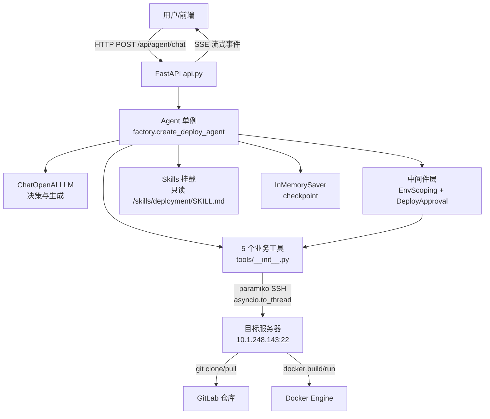
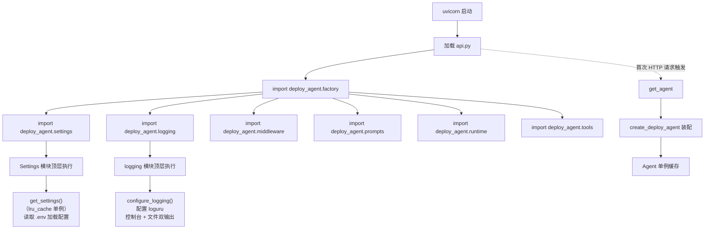
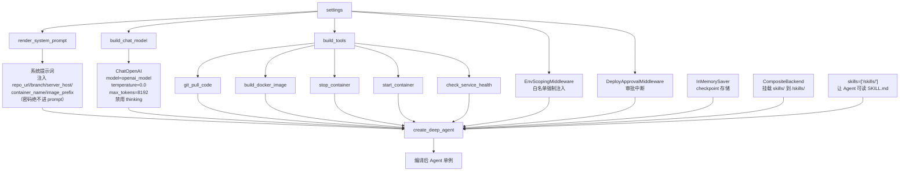
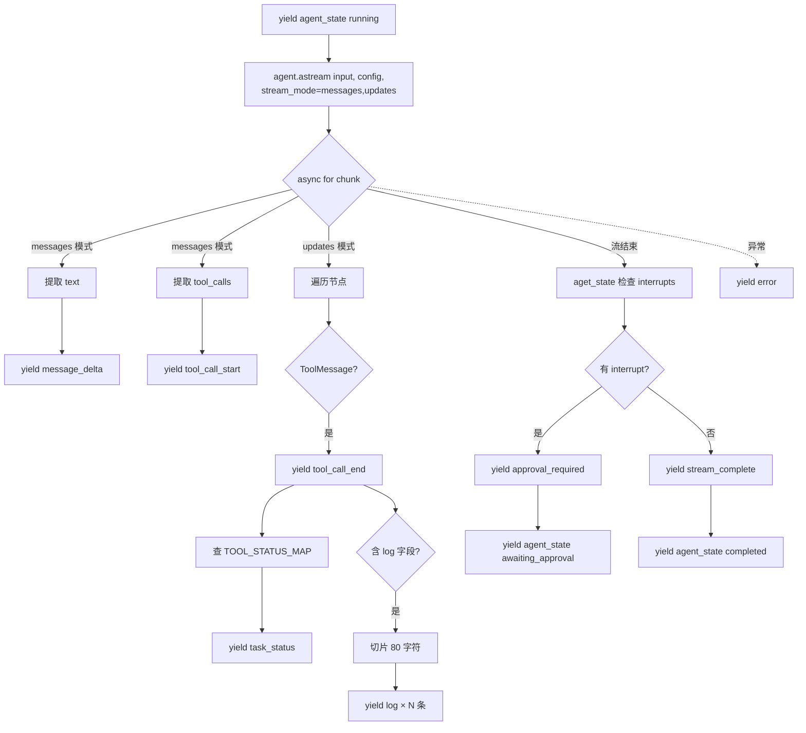
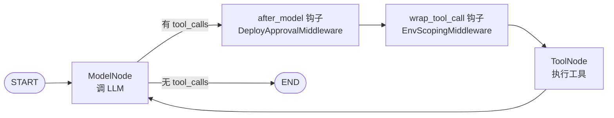
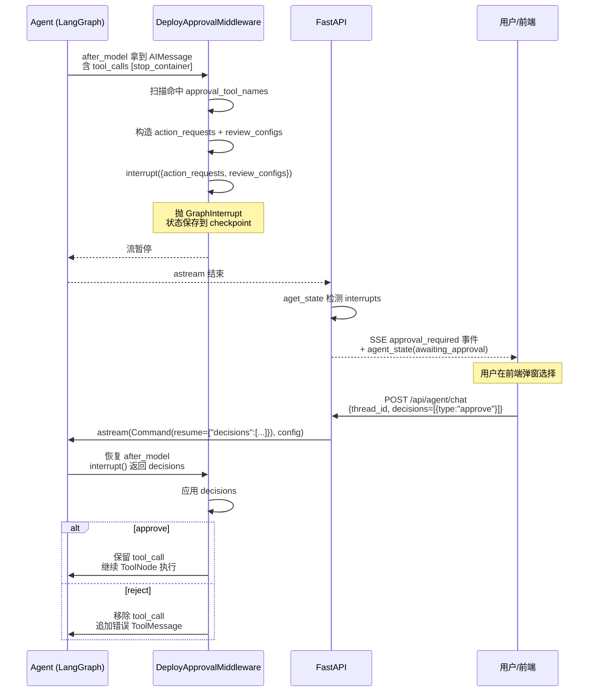
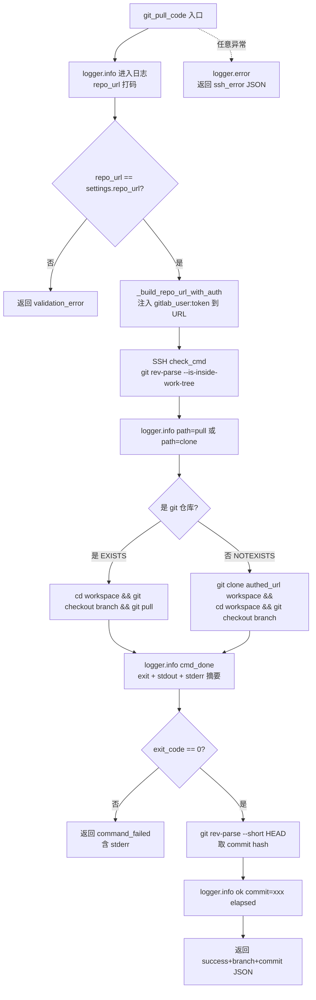
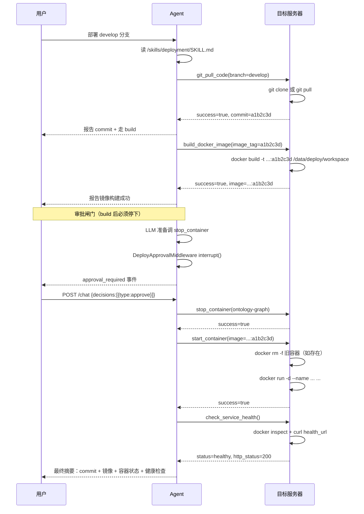

# 部署 Agent 项目运转流程

> 本文档详细解析 `agent-deploy-demo` 项目的运转流程，从启动、装配、对话流转、审批中断、工具执行到日志安全。
> 适合作为项目主文档长期保存，配合源码阅读。

---

## 目录

1. [项目概览](#1-项目概览)
2. [项目结构与模块职责](#2-项目结构与模块职责)
3. [核心概念铺垫](#3-核心概念铺垫面向小白)
4. [启动与初始化流程](#4-启动与初始化流程)
5. [Agent 装配流程](#5-agent-装配流程factorypy-内部)
6. [一次对话请求的完整流转](#6-一次对话请求的完整流转)
7. [Agent 内部决策循环](#7-agent-内部决策循环langgraph-驱动)
8. [审批中断与恢复机制](#8-审批中断与恢复机制重点章节)
9. [工具内部执行流程](#9-工具内部执行流程以-git_pull_code-为例)
10. [标准部署 SOP 时序](#10-标准部署-sop-时序)
11. [安全设计要点](#11-安全设计要点)
12. [日志规范](#12-日志规范)
13. [配置项速查表](#13-配置项速查表)
14. [测试覆盖](#14-测试覆盖)

---

## 1. 项目概览

### 1.1 项目目标

构建一个**基于 DeepAgents 框架的部署 Agent**，实现从用户提出部署需求，到自动完成「代码拉取 → 镜像构建 → 审批 → 停旧容器 → 起新容器 → 健康检查」的全流程自动化。

Agent 具备以下能力：
- **工具调用**：通过 5 个受控工具操作目标服务器
- **任务编排**：按 SOP 顺序自动执行部署步骤
- **人工审批**：高风险操作（stop/start container）需用户批准后才执行
- **实时交互**：通过 SSE 流式输出执行进度
- **错误处理**：失败重试一次，仍失败如实报告

### 1.2 技术栈

| 类别 | 选型 | 版本 | 用途 |
|------|------|------|------|
| Agent 框架 | DeepAgents | 0.4.12 | 提供 Agent 核心 + 中间件 + Skills 挂载 |
| 工作流引擎 | LangGraph（DeepAgents 内置） | - | 状态机、checkpoint、interrupt/resume |
| LLM 接入 | langchain-openai | 1.2.1 | ChatOpenAI 兼容 OpenAI 协议的模型 |
| Web 框架 | FastAPI | ≥0.135.2 | HTTP 接口 + SSE 流式响应 |
| SSH 客户端 | paramiko | ≥3.5.0 | 远程执行 git/docker 命令 |
| 配置管理 | pydantic-settings | ≥2.13.1 | 从 .env 加载配置 |
| 日志 | loguru | ≥0.7.3 | 控制台 + 文件双输出 |
| Web 服务器 | uvicorn | ≥0.42.0 | ASGI 服务器 |
| 测试 | pytest + pytest-asyncio | ≥8.0 / ≥0.24 | 异步测试 |

### 1.3 整体架构



**关键设计点**：Agent 所在的机器只负责编排，git/docker 等操作通过 SSH 到目标服务器执行，避免本机环境污染。

---

## 2. 项目结构与模块职责

### 2.1 目录树

```
agent-deploy-demo/
├── backend/                          # 后端项目根（pyproject.toml 在此）
│   ├── pyproject.toml               # 项目元数据与依赖
│   ├── .env                         # 配置文件（密码、token 在此）
│   ├── README.md                    # （空，待补）
│   ├── skills/
│   │   └── deployment/
│   │       └── SKILL.md             # 部署技能文档（Agent 唯一工具参考）
│   ├── src/
│   │   └── deploy_agent/
│   │       ├── __init__.py           # 包入口，导出各子模块
│   │       ├── api.py                # FastAPI 接口 + SSE 事件流
│   │       ├── factory.py            # Agent 工厂（装配 LLM/工具/中间件）
│   │       ├── middleware.py         # 两个中间件：审批 + 白名单注入
│   │       ├── prompts.py            # 系统提示词模板与渲染
│   │       ├── runtime.py             # RuntimeContext schema
│   │       ├── settings.py           # .env 配置加载（Settings 类）
│   │       ├── logging.py            # loguru 日志配置
│   │       └── tools/
│   │           └── __init__.py      # 5 个业务工具（SSH 执行）
│   ├── tests/
│   │   ├── test_tools.py             # 工具测试（17 个用例）
│   │   ├── test_approval.py          # 审批中间件测试
│   │   └── test_skills.py            # Skills 挂载测试
│   └── logs/
│       └── deploy_agent.log          # 运行时日志（50MB 轮转）
```

### 2.2 各模块职责一句话

| 模块 | 职责 |
|------|------|
| [api.py](backend/src/deploy_agent/api.py) | FastAPI 路由：`POST /api/agent/chat` 提交任务、`GET /healthz` 健康检查；SSE 事件流翻译 |
| [factory.py](backend/src/deploy_agent/factory.py) | Agent 装配工厂：构建 LLM、工具、中间件，调 `create_deep_agent` 组装 |
| [middleware.py](backend/src/deploy_agent/middleware.py) | 两个中间件：`DeployApprovalMiddleware`（审批中断）、`EnvScopingMiddleware`（白名单强制注入） |
| [prompts.py](backend/src/deploy_agent/prompts.py) | 系统提示词模板，用 settings 注入目标环境事实（**密码绝不进提示词**） |
| [runtime.py](backend/src/deploy_agent/runtime.py) | RuntimeContext schema（容器名/镜像 tag/环境/用户 ID） |
| [settings.py](backend/src/deploy_agent/settings.py) | `.env` 配置加载，`get_settings()` 单例 |
| [logging.py](backend/src/deploy_agent/logging.py) | loguru 配置：控制台 + 文件双输出，模块导入时自动配置 |
| [tools/__init__.py](backend/src/deploy_agent/tools/__init__.py) | 5 个业务工具，全部通过 paramiko SSH 在目标服务器执行 |
| [skills/deployment/SKILL.md](backend/skills/deployment/SKILL.md) | Agent 唯一工具参考手册：参数表、示例、返回示例、常见错误 |

---

## 3. 核心概念铺垫（面向小白）

### 3.1 DeepAgents 与 LangGraph 的关系

- **LangGraph**：基于状态图的执行引擎，把"Agent 工作"建模为一张图（节点 = 函数，边 = 转移条件）。支持 checkpoint（保存状态）、interrupt（中断）、resume（恢复）。
- **DeepAgents**：在 LangGraph 之上的封装，提供 `create_deep_agent` 一行装配 Agent 的工厂方法，内置 ToolNode、Skills 挂载、中间件机制。
- 本项目用的就是 DeepAgents，但 interrupt/resume/checkpoint 都是 LangGraph 提供的。

### 3.2 Tool Calling 是什么

LLM 在对话中不仅输出文本，还可以输出**结构化的工具调用请求**（tool_calls），格式形如：

```json
{"name": "git_pull_code", "args": {"repo_url": "...", "branch": "develop"}, "id": "call_abc"}
```

Agent 框架拿到 tool_calls 后，调对应工具，把结果作为 ToolMessage 喂回 LLM，LLM 基于结果决定下一步。这是 Agent 自动化的核心机制。

### 3.3 Checkpoint 与 thread_id

- **thread_id**：每次对话的唯一标识，写在 `config = {"configurable": {"thread_id": "xxx"}}`。
- **Checkpoint**：LangGraph 在每一步执行后把状态（消息列表、工具结果等）存到 checkpointer。本项目用 `InMemorySaver`（内存版本，进程重启即丢失）。
- **作用**：同一个 thread_id 的对话共享历史；中断后用户用相同 thread_id 恢复时，Agent 能从中断点继续。

### 3.4 SSE 流式输出

- **SSE（Server-Sent Events）**：HTTP 长连接，服务器持续推送事件给前端，前端无需轮询。
- 每个事件格式：`event: <事件类型>\ndata: <JSON>\n\n`
- 本项目 SSE 事件类型见 [§6.4](#64-sse-事件类型)。

### 3.5 Human-in-the-loop（人工审批）

Agent 在执行到高风险步骤时，**主动暂停**，等待人工决策：
- Agent 调 `interrupt(payload)` 抛 `GraphInterrupt`，流式响应结束
- 前端收到 `approval_required` 事件，弹窗让用户选择
- 用户选 approve/reject 后，前端再发一次请求带 `decisions`，Agent 用 `Command(resume=...)` 恢复从中断点继续

---

## 4. 启动与初始化流程

### 4.1 启动入口

启动命令（典型）：

```bash
cd agent-deploy-demo/backend
uv run uvicorn deploy_agent.api:app --host 0.0.0.0 --port 8000
```

- `deploy_agent.api:app` 指向 [api.py](backend/src/deploy_agent/api.py) 的 `app = FastAPI(...)` 对象
- uvicorn 加载 app 时会执行模块顶层代码

### 4.2 模块导入链与自动初始化



**关键点**：
1. `logging.py` 在模块顶层调用 `configure_logging()`，**模块被 import 时自动配置日志**（[logging.py:112](backend/src/deploy_agent/logging.py#L112)）。这是幂等的，重复 import 不会重复配置。
2. `settings.py` 用 `@lru_cache(maxsize=1)` 装饰 `get_settings()`，保证全进程单例。
3. **Agent 单例是懒加载**：进程启动时不创建 Agent，第一次 HTTP 请求到 `/api/agent/chat` 时才创建（[api.py:183-193](backend/src/deploy_agent/api.py#L183-193)）。这样如果 LLM 配置缺失或网络不通，启动期不报错，只在第一次使用时报错，便于排查。

### 4.3 Settings 加载细节

[settings.py](backend/src/deploy_agent/settings.py) 关键设计：

- 继承 `pydantic_settings.BaseSettings`，通过 `.env` 文件 + 环境变量加载配置
- 敏感字段（`openai_api_key`、`gitlab_token`、`server_password`）用 `SecretStr` 类型，避免被意外打印
- `settings_customise_sources` 让 `.env` 优先于 shell 环境变量（开发者笔记本友好）
- `_empty_string_to_none` validator 把空字符串转 `None`，避免 `AnyHttpUrl` 等校验失败

加载顺序（[settings.py:93-106](backend/src/deploy_agent/settings.py#L93-106)）：

1. `.env` 文件存在 → `.env` 优先于 shell env
2. `.env` 不存在 → 退回 shell env + 代码默认值

---

## 5. Agent 装配流程（factory.py 内部）

`create_deploy_agent`（[factory.py:99-146](backend/src/deploy_agent/factory.py#L99-146)）是 Agent 的总装车间。

### 5.1 装配流程图



### 5.2 LLM 构建（build_chat_model）

[factory.py:45-80](backend/src/deploy_agent/factory.py#L45-80) 关键参数：

- `max_tokens=8192`：与 `.env` 的 `MODEL_MAX_TOKENS` 对齐
- **禁用 thinking**：通过 `extra_body.chat_template_kwargs.enable_thinking=False` + `thinking.type=disabled` 显式关闭，避免兼容 OpenAI 协议的模型（如 Qwen）输出冗余思考内容
- `temperature=0.0`：部署任务要确定性，不要随机性
- `api_key` / `base_url` 从 settings 读取（支持兼容 OpenAI 协议的任意模型，如 Qwen、DeepSeek）

### 5.3 Skills 挂载（_build_deploy_backend）

[factory.py:83-96](backend/src/deploy_agent/factory.py#L83-96) 用 `CompositeBackend` 把文件系统中的 `backend/skills/` 目录**虚拟挂载**到 Agent 内部路径 `/skills/`：

```python
CompositeBackend(
    default=StateBackend(runtime),
    routes={
        "/skills/": FilesystemBackend(root_dir=_SKILLS_ROOT, virtual_mode=True),
    },
)
```

- `virtual_mode=True`：只读，Agent 不能写文件
- Agent 通过 DeepAgents 内置的文件读取工具读 `/skills/deployment/SKILL.md`，学习工具的正确用法
- 系统提示词明确要求：**调工具前必须先读 SKILL.md 对应小节**（[prompts.py:37-43](backend/src/deploy_agent/prompts.py#L37-43)）

### 5.4 中间件注册顺序

```python
middleware=[
    EnvScopingMiddleware(resolved_settings),    # 先执行：白名单强制注入
    DeployApprovalMiddleware(resolved_settings), # 后执行：审批中断
]
```

- **EnvScopingMiddleware** 在 `wrap_tool_call` 钩子介入，覆盖 tool_call 的白名单字段
- **DeployApprovalMiddleware** 在 `after_model` 钩子介入，对审批名单工具触发 `interrupt()`

---

## 6. 一次对话请求的完整流转

### 6.1 HTTP 入口

```http
POST /api/agent/chat
Content-Type: application/json

{
  "message": "请部署 develop 分支",
  "thread_id": "t-1700000000",
  "decisions": null   // 新对话为 null；恢复中断时填 [{type: "approve"}]
}
```

[api.py:197-227](backend/src/deploy_agent/api.py#L197-227) 处理逻辑：

1. 调 `get_agent()` 拿单例
2. 缺省 `thread_id` 用 `f"t-{int(time.time())}"` 生成
3. 构造 `config = {"configurable": {"thread_id": thread_id}}`
4. 根据 `decisions` 分两种输入：
   - **新对话**：`agent_input = {"messages": [{"role": "user", "content": message}]}`
   - **恢复中断**：`agent_input = Command(resume={"decisions": req.decisions})`

### 6.2 HTTP 中间件：请求日志

[api.py:151-169](backend/src/deploy_agent/api.py#L151-169) 注册了 HTTP 中间件 `log_requests`，记录每个请求的方法、路径、状态码、耗时、thread_id：

```
HTTP | method=POST | path=/api/agent/chat | status=200 | elapsed=5234ms | thread_id=t-1700000000
```

### 6.3 SSE 事件生成器（event_generator）

[api.py:229-431](backend/src/deploy_agent/api.py#L229-431) 是核心异步生成器。流程：



### 6.4 SSE 事件类型

| 事件类型 | 触发时机 | 关键字段 |
|---------|---------|---------|
| `agent_state` | Agent 状态变化 | `status`: running / awaiting_approval / completed |
| `message_delta` | LLM 文本增量 | `text` |
| `tool_call_start` | LLM 决定调用工具 | `name`, `args`, `call_id` |
| `tool_call_end` | 工具执行完成 | `name`, `result`, `call_id` |
| `task_status` | 工具对应的部署阶段 | `status`: GIT_PULL / BUILD_IMAGE / STOP_CONTAINER / START_CONTAINER / HEALTH_CHECK |
| `log` | 工具返回的 log 字段切片 | `text`（每 80 字符一条） |
| `approval_required` | 需要人工审批 | `action_requests`, `review_configs` |
| `stream_complete` | 流正常结束 | `final_result` |
| `error` | 流异常 | `message` |

### 6.5 响应头

```python
StreamingResponse(
    event_generator(),
    media_type="text/event-stream",
    headers={
        "Cache-Control": "no-cache",
        "Connection": "keep-alive",
        "X-Accel-Buffering": "no",  # 禁用 nginx 缓冲
    },
)
```

`X-Accel-Buffering: no` 是关键，告诉 nginx 不要缓冲 SSE 流，否则前端会等到所有事件累积完才收到。

---

## 7. Agent 内部决策循环（LangGraph 驱动）

### 7.1 LangGraph 图结构

DeepAgents 的 `create_deep_agent` 内部构建了一个 LangGraph 图，大致结构：



### 7.2 一次循环的步骤

1. **ModelNode 调 LLM**：把 messages + system prompt 喂给 LLM
2. **LLM 输出 AIMessage**：含文本 + 可选 tool_calls
3. **after_model 钩子**：`DeployApprovalMiddleware.after_model` 扫描 tool_calls
   - 命中审批名单 → `interrupt()` 抛 `GraphInterrupt`，流暂停
   - 未命中 → 继续
4. **wrap_tool_call 钩子**：`EnvScopingMiddleware.wrap_tool_call` 强制注入白名单字段（如 `container_name`、`repo_url`）
5. **ToolNode 执行**：调对应工具的 async 函数
6. **工具内部 SSH 执行**：见 [§9](#9-工具内部执行流程以-git_pull_code-为例)
7. **ToolMessage 回流**：工具返回结构化 JSON 字符串，作为 ToolMessage 加到 messages
8. **回到步骤 1**：LLM 基于 ToolMessage 决定下一步
9. **LLM 不再调工具**：输出最终文本摘要，图结束

### 7.3 stream_mode=["messages", "updates"]

[api.py:244-248](backend/src/deploy_agent/api.py#L244-248) 用了两种流式模式：

- **messages 模式**：LLM 每生成一段文本/工具调用意图就推送（增量）
- **updates 模式**：每个节点（如 ToolNode）执行完推送状态更新（含 ToolMessage）

每个 chunk 是 `(mode, payload)` 元组，[api.py:251-264](backend/src/deploy_agent/api.py#L251-264) 分别处理。

---

## 8. 审批中断与恢复机制（重点章节）

### 8.1 整体流程



### 8.2 interrupt() 触发点：必须在 after_model

[middleware.py:182-231](backend/src/deploy_agent/middleware.py#L182-231) 的关键设计：**`interrupt()` 必须在 `after_model` 中调用，不能在 `wrap_tool_call` 中**。

**为什么？** 参考注释 [middleware.py:9-11](backend/src/deploy_agent/middleware.py#L9-11)：
- `wrap_tool_call` 是 ToolNode 内部钩子，在那里抛的 `GraphInterrupt` 会被 ToolNode 的异常处理器**静默吞掉**
- `after_model` 是 ModelNode 之后、ToolNode 之前的钩子，在那里抛的 `GraphInterrupt` 会被 LangGraph 正确捕获，触发 checkpoint + 流暂停

### 8.3 审批名单配置

[settings.py:79-82](backend/src/deploy_agent/settings.py#L79-82)：

```python
approval_required_tools_raw: str = Field(
    default="stop_container,start_container",
    validation_alias="APPROVAL_REQUIRED_TOOLS",
)
```

- 默认 `stop_container` 和 `start_container` 需审批
- 支持两种格式（[settings.py:130-145](backend/src/deploy_agent/settings.py#L130-145)）：
  - 逗号分隔：`stop_container,start_container`
  - JSON 数组：`["stop_container", "start_container"]`

### 8.4 approval_required 事件数据

[api.py:393-403](backend/src/deploy_agent/api.py#L393-403) 从 interrupt 对象提取：

```json
{
  "thread_id": "t-1700000000",
  "action_requests": [
    {
      "name": "stop_container",
      "args": {"container_name": "ontology-graph"},
      "description": "停止容器 ontology-graph"
    }
  ],
  "review_configs": [
    {
      "action_name": "stop_container",
      "allowed_decisions": ["approve", "reject"]
    }
  ]
}
```

`description` 由 [_build_action_description](backend/src/deploy_agent/middleware.py#L94-109) 生成中文描述。

### 8.5 三种决策处理

`_process_decision`（[middleware.py:138-180](backend/src/deploy_agent/middleware.py#L138-180)）：

| 决策类型 | 行为 |
|---------|------|
| `approve` | 保留原 tool_call，继续执行 |
| `reject` | 返回错误 ToolMessage（status=error），从 tool_calls 移除；同时把拒绝原因追加到 AIMessage，让下一轮 LLM 理解 |
| `edit` | Demo 不支持编辑，按 reject 处理并提示 |

**为什么 reject 要追加文本到 AIMessage？** 参考注释 [middleware.py:9-13](backend/src/deploy_agent/middleware.py#L9-13)：
- 如果只返回错误 ToolMessage 但不修改 AIMessage，下一轮 LLM 会因为缺少 tool_call 对应的 ToolMessage 报协议错误（孤儿 ToolMessage）
- 把拒绝原因追加到 AIMessage，让 LLM 知道"用户拒绝了这次调用，不要再尝试"

### 8.6 单条决策广播

[middleware.py:244-248](backend/src/deploy_agent/middleware.py#L244-248) 有一个特殊处理：

```python
# 单条决策广播到多个中断项
if len(decisions) == 1 and len(interrupt_indices) > 1:
    only_decision = decisions[0]
    if isinstance(only_decision, dict) and only_decision.get("type") in {"approve", "reject"}:
        decisions = [only_decision] * len(interrupt_indices)
```

**为什么这样设计？** 用户在前端可能只想"全部批准"或"全部拒绝"，只发一条 decision，但 Agent 同时调了多个审批工具（如 stop + start 一起调）。把单条 decision 复制到所有中断项，用户体验更好。

### 8.7 决策数量校验

[middleware.py:251-261](backend/src/deploy_agent/middleware.py#L251-261)：

```python
if (decisions_len := len(decisions)) != (interrupt_count := len(interrupt_indices)):
    raise ValueError(
        f"决策数量 ({decisions_len}) 与待审批工具调用数量 ({interrupt_count}) 不匹配。"
    )
```

如果不匹配直接抛错，避免静默错误。

---

## 9. 工具内部执行流程（以 git_pull_code 为例）

### 9.1 工具构建器模式

[tools/__init__.py](backend/src/deploy_agent/tools/__init__.py) 用闭包工厂模式：

```python
def build_git_pull_code_tool(settings: Settings):
    @tool
    async def git_pull_code(repo_url: str, branch: str, workspace: str) -> str:
        # 通过闭包捕获 settings，无需全局变量
        ...
    return git_pull_code
```

**为什么用闭包？**
- 把 settings 注入工具内部，工具函数签名干净（参数只有 LLM 传的 repo_url/branch/workspace）
- 每个 Agent 实例可以用不同 settings 构建独立工具集

### 9.2 git_pull_code 完整流程

[tools/__init__.py:125-242](backend/src/deploy_agent/tools/__init__.py#L125-242)：



### 9.3 关键节点日志（已加）

| 节点 | 位置 | 日志内容 |
|------|------|---------|
| 进入 | [tools/__init__.py:144-150](backend/src/deploy_agent/tools/__init__.py#L144-150) | `args=repo_url=ht***it branch=develop workspace=...`（repo_url 打码） |
| 分支选择 | [tools/__init__.py:185-216](backend/src/deploy_agent/tools/__init__.py#L185-216) | `path=pull` 或 `path=clone`，一眼识别本次部署路径 |
| 命令执行结果 | [tools/__init__.py:204-210, 230-236](backend/src/deploy_agent/tools/__init__.py#L204-210) | `cmd_done | exit=0 | stdout=... | stderr=...`，含 git 关键输出 |
| 成功 | [tools/__init__.py:258-265](backend/src/deploy_agent/tools/__init__.py#L258-265) | `ok | commit=xxx | elapsed=...ms` |

### 9.4 SSH 执行底层（_run_ssh）

[tools/__init__.py:77-111](backend/src/deploy_agent/tools/__init__.py#L77-111)：

```python
async def _run_ssh(settings, command, timeout=60):
    def _execute():
        client = paramiko.SSHClient()
        client.set_missing_host_key_policy(paramiko.AutoAddPolicy())
        try:
            client.connect(hostname=..., port=..., username=..., password=..., timeout=timeout)
            stdin, stdout, stderr = client.exec_command(command, timeout=timeout)
            exit_code = stdout.channel.recv_exit_status()
            return exit_code, stdout.read().decode(), stderr.read().decode()
        finally:
            client.close()
    return await asyncio.to_thread(_execute)
```

**两个关键设计**：
1. **`asyncio.to_thread` 包装同步 paramiko**：paramiko 是阻塞库，直接调会卡住事件循环。`to_thread` 丢到线程池执行，让其他协程并发。
2. **每次命令都新建 SSH 连接**：简化实现，避免连接复用的状态问题。如果性能要求高，可改用持久连接池。

### 9.5 结构化 JSON 返回（绝不 raise）

辅助函数（[tools/__init__.py:42-52](backend/src/deploy_agent/tools/__init__.py#L42-52)）：

```python
def _ok(**fields) -> str:
    return json.dumps({"success": True, **fields}, ensure_ascii=False)

def _err(error_type, message, **extra) -> str:
    return json.dumps({"success": False, "error_type": ..., "message": ..., **extra}, ensure_ascii=False)
```

**为什么绝不 raise？** LLM 收到的是文本，Python 异常堆栈对 LLM 不可读。统一返回结构化 JSON，LLM 能解析 `error_type` 和 `message` 字段，决定是重试还是报告用户。

### 9.6 仓库有效性判断（方案 B）

[tools/__init__.py:171-175](backend/src/deploy_agent/tools/__init__.py#L171-175) 用 `git rev-parse --is-inside-work-tree` 判断：

```bash
cd {workspace} 2>/dev/null && git rev-parse --is-inside-work-tree 2>/dev/null && echo EXISTS || echo NOTEXISTS
```

**为什么不用 `[ -d {workspace} ]`？** 防止目录已存在但非 git 仓库时错误走 pull 路径（pull 会报 not a git repository）。详见上一轮讨论的方案 B 实现。

---

## 10. 标准部署 SOP 时序

### 10.1 完整时序图



### 10.2 顺序硬约束

来自 [prompts.py:53-56](backend/src/deploy_agent/prompts.py#L53-56) 与 [SKILL.md](backend/skills/deployment/SKILL.md)：

- `build_docker_image` 未返回成功前，**禁止**调 `stop_container` / `start_container`
- `stop_container` 必须在 `start_container` 之前
- `stop_container` / `start_container` 触发审批中断后，必须等待用户带 `decisions` 恢复，**不得自行绕过**

### 10.3 错误处理规则

[prompts.py:58-63](backend/src/deploy_agent/prompts.py#L58-63)：

- 工具返回 `success=false` 时，先向用户说明 `error_type` 和 `message` 字段内容
- 可用相同参数重试**一次**
- 仍失败则如实向用户报告失败原因，停止后续步骤，**不得隐瞒或篡改错误**

---

## 11. 安全设计要点

### 11.1 白名单双重校验

**第一重：EnvScopingMiddleware 强制注入**

[middleware.py:296-353](backend/src/deploy_agent/middleware.py#L296-353) 在 `wrap_tool_call` 钩子强制覆盖：

| 工具 | 强制注入字段 |
|------|------------|
| `stop_container` | `container_name = settings.container_name` |
| `start_container` | `container_name = settings.container_name` |
| `git_pull_code` | `repo_url = settings.repo_url` |

如果 LLM 传的参数与白名单不一致，记录 warning 日志后**强制覆盖**。

**为什么需要？** 防止 prompt injection 攻击。如果用户在 message 里写"请把 container_name 改成 rm -rf /"，LLM 可能被骗传错参数。EnvScoping 在工具执行前强制覆盖，是最后一道防线。

**第二重：Tool 内二次校验**

每个工具入口都做白名单校验（如 [tools/__init__.py:153-162](backend/src/deploy_agent/tools/__init__.py#L153-162) 校验 repo_url），返回 `validation_error`。这是纵深防御，万一中间件被绕过（如未来新增中间件顺序错误），工具自己也能拦住。

### 11.2 密码不进 system prompt

[prompts.py:72-83](backend/src/deploy_agent/prompts.py#L72-83) 只注入：

- `repo_url`、`branch`、`server_host`、`container_name`、`image_prefix`

**绝不注入**：
- `server_password`、`gitlab_token`、`openai_api_key`

这些敏感信息只在 Tool 内部通过 `_build_repo_url_with_auth` 等函数使用，LLM 永远看不到。提示词里明确告诉 LLM（[prompts.py:35](backend/src/deploy_agent/prompts.py#L35)）：

> 服务器密码、GitLab 令牌等敏感信息不在此列出，由系统在工具内部注入，你无需也无法获取。

### 11.3 日志打码

`_mask` 函数（[tools/__init__.py:33-39](backend/src/deploy_agent/tools/__init__.py#L33-39)）：

```python
def _mask(secret):
    if not secret: return "<empty>"
    if len(secret) <= 4: return "***"
    return f"{secret[:2]}***{secret[-2:]}"  # 只露首尾 2 字符
```

打码对象：
- `repo_url` 在 args 日志中（[tools/__init__.py:147](backend/src/deploy_agent/tools/__init__.py#L147)）
- `image` 在 start_container 的 args 日志中
- middleware 的 `_mask_args` 函数对 `password/token/api_key/server_password/gitlab_token` 全部打码（[middleware.py:81-91](backend/src/deploy_agent/middleware.py#L81-91)）

### 11.4 clone 命令日志不含 URL

[tools/__init__.py:222-227](backend/src/deploy_agent/tools/__init__.py#L222-227)：

```python
logger.info(
    "tool={} | host={} | cmd=git clone ... {}",
    tool_name, settings.server_host, workspace,
)
```

只记 `git clone ...`，**不含完整 URL**（URL 含 gitlab_token）。clone 输出形如 `Cloning into 'xxx'...`，stdout 摘要里也不含 token，可安全打印。

---

## 12. 日志规范

### 12.1 日志格式

统一格式：`time | level | module:function:line - message`

message 采用 `key=value | key=value | ...` 形式，便于 grep。

### 12.2 关键节点日志

| 节点 | 日志样例 |
|------|---------|
| HTTP 请求 | `HTTP \| method=POST \| path=/api/agent/chat \| status=200 \| elapsed=5234ms \| thread_id=t-xxx` |
| 工具进入 | `tool=git_pull_code \| args=repo_url=ht***it branch=develop workspace=/data/app` |
| 分支选择 | `tool=git_pull_code \| path=pull \| workspace 已是 git 仓库，执行增量拉取` |
| 命令结果 | `tool=git_pull_code \| cmd_done \| exit=0 \| stdout=Updating a1b2c3d..e4f5g6h \| stderr=` |
| 工具成功 | `tool=git_pull_code \| ok \| commit=e4f5g6h \| elapsed=4521ms` |
| 工具失败 | `tool=git_pull_code \| error=git_failed exit=128 \| elapsed=234ms` |
| SSH 异常 | `tool=git_pull_code \| error=SSH connection refused \| elapsed=12ms` |
| 审批触发 | `APPROVAL \| event=required \| thread_id=t-xxx \| tool=stop_container \| args=...` |
| 审批决策 | `APPROVAL \| event=decided \| thread_id=t-xxx \| decision_type=approve \| tool=stop_container` |
| 白名单覆盖 | `ENV_SCOPING \| event=override \| tool=stop_container \| field=container_name \| old=wrong \| new=ontology-graph` |
| SSE 流开始 | `SSE \| event=stream_start \| thread_id=t-xxx \| mode=new \| message=...` |

### 12.3 日志配置

[logging.py:64-108](backend/src/deploy_agent/logging.py#L64-108)：

- **控制台输出**：stderr，彩色，级别由 `LOG_LEVEL` 控制
- **文件输出**：`{LOG_DIR}/deploy_agent.log`，轮转 50MB，保留 7 份，UTF-8 编码
- **LOG_DIR 不存在自动创建**（`mkdir(parents=True, exist_ok=True)`）
- **相对路径基于项目根目录（backend/）解析**，不随 cwd 变化
- **降级机制**：settings 加载失败时退回环境变量 + 默认值，保证 logger 永远可用

### 12.4 幂等配置

`_CONFIGURED` 标志位（[logging.py:30](backend/src/deploy_agent/logging.py#L30)）防止重复 add handler，重复 import 不会重复输出。

---

## 13. 配置项速查表

### 13.1 .env 字段说明

| 环境变量 | 类型 | 默认值 | 用途 |
|---------|------|--------|------|
| `OPENAI_API_KEY` | SecretStr | - | LLM API Key |
| `OPENAI_BASE_URL` | AnyHttpUrl | - | LLM Base URL（兼容 OpenAI 协议） |
| `OPENAI_MODEL` | str | `gpt-4o-mini` | 模型名 |
| `OPENAI_TEMPERATURE` | float | `0.0` | 温度（部署任务要确定性） |
| `REPO_URL` | str | - | 仓库白名单地址 |
| `BRANCH` | str | `develop` | 默认分支 |
| `CONTAINER_NAME` | str | - | 容器名白名单 |
| `IMAGE_PREFIX` | str | - | 镜像名前缀白名单 |
| `GITLAB_TOKEN` | SecretStr | - | GitLab 拉取令牌 |
| `GITLAB_USER` | str | - | GitLab 账号 |
| `SERVER_HOST` | str | - | 目标服务器 IP |
| `SERVER_PORT` | int | `22` | SSH 端口 |
| `SERVER_USER` | str | - | SSH 用户 |
| `SERVER_PASSWORD` | SecretStr | - | SSH 密码 |
| `HEALTH_URL` | str | - | 健康检查 URL |
| `IMAGE_TAG_FORMAT` | str | `%Y%m%d-%H%M%S` | 镜像 tag 时间戳格式 |
| `DOCKER_HOST` | str | - | Docker 主机（空=本机） |
| `APPROVAL_REQUIRED_TOOLS` | str | `stop_container,start_container` | 需审批工具名单 |
| `HOST` | str | `127.0.0.1` | 服务监听 IP |
| `PORT` | int | `8000` | 服务监听端口 |
| `LOG_LEVEL` | str | `INFO` | 日志级别 |
| `LOG_DIR` | str | `logs` | 日志目录（相对项目根） |

### 13.2 APPROVAL_REQUIRED_TOOLS 两种格式

[settings.py:130-145](backend/src/deploy_agent/settings.py#L130-145)：

```
# 逗号分隔（默认）
APPROVAL_REQUIRED_TOOLS=stop_container,start_container

# JSON 数组
APPROVAL_REQUIRED_TOOLS=["stop_container","start_container"]
```

解析函数自动识别（`stripped.startswith("[")`）。

---

## 14. 测试覆盖

### 14.1 测试文件

| 文件 | 用例数 | 覆盖范围 |
|------|--------|---------|
| [test_tools.py](backend/tests/test_tools.py) | 17 | 5 个工具的参数校验 + SSH 执行路径 |
| [test_approval.py](backend/tests/test_approval.py) | - | DeployApprovalMiddleware 的 approve/reject/edit |
| [test_skills.py](backend/tests/test_skills.py) | - | Skills 挂载与读取 |

### 14.2 test_tools.py 用例分布（17 个）

**参数校验分支（5 个，不走 SSH）**：
- `test_git_pull_code_wrong_repo_url` — repo_url 不在白名单
- `test_stop_container_wrong_name` — container_name 错误
- `test_build_docker_image_wrong_prefix` — image 前缀错误
- `test_start_container_wrong_image_prefix` — image 前缀错误
- `test_start_container_wrong_container_name` — container_name 错误

**SSH 执行分支（11 个，monkeypatch _run_ssh）**：
- `test_git_pull_code_success` — clone 成功路径
- `test_git_pull_code_command_failed` — git 命令失败
- `test_git_pull_code_ssh_exception` — SSH 连接异常
- `test_git_pull_code_dir_exists_not_git_repo` — **方案 B 修正点**：目录存在但非 git 仓库时走 clone
- `test_build_docker_image_success` / `test_build_docker_image_failed`
- `test_stop_container_success`
- `test_start_container_success` / `test_start_container_run_failed`（验证先 rm 再 run）
- `test_check_service_health_healthy` / `test_check_service_health_unhealthy`

**装配测试（1 个）**：
- `test_build_tools_returns_5` — `build_tools` 返回 5 个工具

### 14.3 monkeypatch 模式

测试用 `monkeypatch.setattr(tools, "_run_ssh", fake_run_ssh)` 替换 SSH 调用，**无需真实目标服务器**：

```python
async def fake_run_ssh(s, command, timeout=60):
    # 通过关键字识别不同命令，返回模拟结果
    if "is-inside-work-tree" in command:
        return 0, "NOTEXISTS\n", ""   # 模拟非 git 仓库
    if "rev-parse --short HEAD" in command:
        return 0, "a81f92c\n", ""     # 模拟 commit hash
    return 0, "", ""                  # 默认成功
```

**为什么 mock `_run_ssh` 而不是 mock paramiko？**
- `_run_ssh` 是项目自定义的函数，是 SSH 调用的唯一入口
- mock 它等于 mock 整个 SSH 层，测试不依赖网络/服务器
- 测试切点明确：`monkeypatch.setattr(tools, "_run_ssh", ...)` 一行替换

### 14.4 pytest-asyncio 配置

[pyproject.toml:33-35](backend/pyproject.toml#L33-35)：

```toml
[tool.pytest.ini_options]
asyncio_mode = "auto"   # 自动识别 async def 测试函数，无需 @pytest.mark.asyncio 装饰器
testpaths = ["tests"]
```

### 14.5 运行测试

```bash
cd agent-deploy-demo/backend
uv run pytest -x tests/test_tools.py -v
```

`-x` 表示第一个失败就停止，便于定位。`-v` 显示每个用例名。

---

## 附录：快速上手 Checklist

1. **环境准备**：`cd agent-deploy-demo/backend && uv sync`
2. **配置 .env**：复制必要字段（OPENAI_API_KEY、REPO_URL、SERVER_* 等）
3. **跑测试**：`uv run pytest -x tests/`
4. **启动服务**：`uv run uvicorn deploy_agent.api:app --port 8000`
5. **健康检查**：`curl http://127.0.0.1:8000/healthz`
6. **发起部署**：
   ```bash
   curl -N -X POST http://127.0.0.1:8000/api/agent/chat \
     -H "Content-Type: application/json" \
     -d '{"message":"请部署 develop 分支"}'
   ```
   `-N` 禁用 curl 缓冲，实时看到 SSE 事件流。
